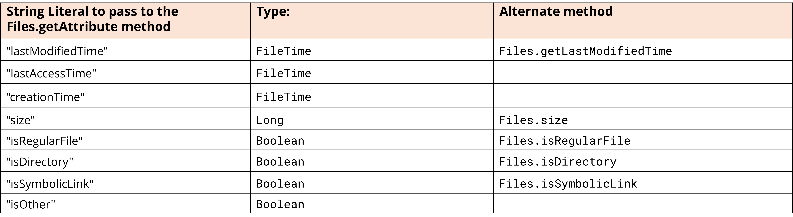

# Buổi 1: Java Core
## Mục tiêu
Hiểu các khái niệm: (Còn trong quá trình thực hiện code sẽ hiểu thêm dần)
- OOP
- Exception
- Collections (List, Set, Map)
- Stream API
- Generic
- Unit Testing
- Build tool (maven/gradle)
- Date Time
- Java IO
Nâng cao:
- Garbage Collection (Học sau)
- Multithread & Concurrency (Học sau)
## Lý thuyết
### OOP
#### Khái niệm
- Lập trình hướng đối tượng (Object-Oriented Programming – OOP) là một phương pháp lập trình sử dụng mô hình lập trình dựa trên các đối tượng có khả năng tương tác với nhau.
- Đối tượng: Thuộc tính + Phương thức
- Lớp là một khuôn mẫu hoặc một mô tả trừu tượng của các đối tượng
Ví dụ: Lớp "Xe" có các thuộc tính màu sắc, thương hiệu và model của xe. Một đối tượng cụ thể của lớp "Xe hơi" có thể là chiếc xe cụ thể
#### Tính chất 
- 1. Tính đóng gói (Encapsulation): giúp bảo vệ dữ liệu và tránh truy cập trực tiếp đến các thuộc tính của đối tượng từ bên ngoài.
    - Ví dụ:
    public class Person {
    private String name;  // Thuộc tính name là private
    private int age;      // Thuộc tính age là private
    // Các phương thức public String getName()... public void setAge(int age)...
    }
    Trong ví dụ này, thuộc tính name và age được khai báo là private, nghĩa là chúng không thể truy cập trực tiếp từ bên ngoài lớp Person. Để lấy hoặc thay đổi giá trị của chúng, chúng ta sử dụng các phương thức công khai getName, getAge, và setAge
- 2. Kế thừa (Inheritance): giúp tái sử dụng mã nguồn và tạo ra cấu trúc phân cấp cho các lớp.
    - Ví dụ: 
    // Lớp cha "Động Vật"
    class Animal {
        void eat() {
            System.out.println("Động vật đang ăn...");
        }
    }
    // Lớp con "Chó" kế thừa từ lớp "Động Vật"
    class Dog extends Animal {
        void bark() {
            System.out.println("Chó sủa...");
        }
    }
    Trong ví dụ này, lớp "Chó" có mọi thông tin và hành vi của lớp "Động Vật," và nó cũng có thể có các phương thức và thuộc tính riêng của nó.

- 3. Tính đa hình (Polymorphism): cho phép thực hiện cùng một hành động trên các đối tượng khác nhau mà không cần quan tâm đến loại đối tượng cụ thể.
    - Ví dụ: // Lớp cha "Hình"
    class Shape {
        void draw() {
            System.out.println("Vẽ hình...");
        }
    }

    // Lớp con "Hình Tròn"
    class Circle extends Shape {
        void draw() {
            System.out.println("Vẽ hình tròn...");
        }
    }

    // Lớp con "Hình Vuông"
    class Square extends Shape {
        void draw() {
            System.out.println("Vẽ hình vuông...");
        }
    }
    Trong ví dụ này, lớp cha "Hình" có một phương thức draw mà các lớp con "Hình Tròn" và "Hình Vuông" ghi đè (override). Điều này có nghĩa là mỗi lớp con có cùng tên phương thức draw, nhưng chúng thực hiện hành động riêng biệt.
- 4. Tính trừu tượng (Abstraction): cho phép bạn tạo ra các lớp và đối tượng trừu tượng, tập trung vào các tính năng quan trọng mà bạn quan tâm và che giấu chi tiết phức tạp bên trong.
    - Ví dụ: // Lớp trừu tượng "Động Vật"
    abstract class Animal {
        abstract void sound(); // Phương thức trừu tượng
    }

    // Lớp con "Chó" kế thừa từ "Động Vật"
    class Dog extends Animal {
        void sound() {
            System.out.println("Gâu gâu!");
        }
    }
    Trong ví dụ này, lớp cha "Động Vật" là một lớp trừu tượng, nghĩa là nó chứa ít nhất một phương thức trừu tượng (sound). Các lớp con "Chó" kế thừa từ lớp cha và phải triển khai phương thức sound dựa trên bản chất riêng của mỗi loài.
#### 1 số thuật ngữ
- Khai báo thuộc tính: [Access Level] [Static] [Type]  [<Tên thuộc tính>]
    - Access Level có thể là một trong các từ public, private, protected hoặc có thể bỏ trống (protected), ý nghĩa của các bổ từ này được mô tả ở phần trên
    - Static là từ khoá báo rằng đây là một thuộc tính lớp, nó là một thuộc tính sử dụng chung cho cả lớp, nó không là của riêng một đối tượng nào.
    - Type là một kiểu dữ liệu nào đó
    - <Tên thuộc tính> là tên của thuộc tính
- Phương thức
    - static: phương thức tĩnh có thể gọi nó trực tiếp từ lớp mà không cần tạo đối tượng của lớp đó
    - abstract: không có cài đặt trong lớp hiện tại và lớp chứa nó phải được đánh dấu là abstract.
    - final: không thể được ghi đè (override) trong các lớp con.
    - native: viết bằng một ngôn ngữ khác và không có cài đặt trong Java.
    - synchronized: là một phương thức đồng bộ (synchronized), nghĩa là chỉ một luồng có thể thực thi phương thức này tại một thời điểm.
- *Cập nhật sau.....*

### Xử lý ngoại lệ (Exception)
#### Khái niệm
- Là một tình trạng bất thường xảy ra trong quá trình thực thi chương trình, phá vỡ luồng chuẩn của chương trình.
- Phân loại: 
    - Checked Exception: IOException, SQLException...
    - Unchecked Exception: NullPointerException, ArithmeticException....
    - Error: OutOfMemoryError, StackOverflowError....
#### Một số thuật ngữ
- 1. Khối *try-catch*: được sử dụng để xử lý các ngoại lệ (exceptions) trong chương trình. 
    - Khi nào dùng ?
        - Lỗi logic: không thể kiểm soát toàn bộ dữ liệu đầu vào và có thể xảy ra lỗi logic
        - Chia cho 0:Khi có phép chia cho 0, Java sẽ ném ra một ngoại lệ ArithmeticException.
        - Kết nối cơ sở dữ liệu: Trong quá trình làm việc với cơ sở dữ liệu, có thể xảy ra các lỗi kết nối.
    - Ví dụ: try {
            int result = 50 / 0; // Sẽ ném ra ArithmeticException
        } catch (ArithmeticException e) {
            System.out.println("Lỗi chia cho 0: " + e.getMessage());
        }
        System.out.println("Chương trình tiếp tục chạy...");
- 2. Khối lệnh *finally* trong java luôn được thực thi cho dù có ngoại lệ xảy ra hay không hoặc gặp lệnh return trong khối try.
- 3. Một số lớp ngoại lệ chuẩn
    - Throwable: lớp cha của mọi lớp ngoại lệ trong Java.
    - Exception: lớp con trực tiếp của lớp Throwable.
    - RuntimeException: Lớp cơ sở cho nhiều ngoại lệ trong java.lang
    - ArithmeticException: Xảy ra khi có lỗi về số học, ví dụ như chia cho 0.
    - IllegalAccessException: Xảy ra khi không thể truy cập một lớp.
    - IllegalArgumentException: Xảy ra khi đối số không hợp lệ.
    - ArrayIndexOutOfBoundsException: Xảy ra khi truy cập ra ngoài mảng.
    - NullPointerException: Xảy ra khi truy cập một đối tượng null.
    - SecurityException: Xảy ra khi cơ chế bảo mật không cho phép thực hiện một thao tác.
    - ClassNotFoundException: Xảy ra khi không thể nạp lớp yêu cầu.
    - NumberFormatException: Xảy ra khi chuyển đổi từ chuỗi sang số không thành công.
    - AWTException: Đây là một lớp ngoại lệ liên quan đến AWT (Abstract Window Toolkit).
    - IOException: Là lớp cha của các lớp ngoại lệ liên quan đến I/O (Input/Output).
    - FileNotFoundException: Xảy ra khi không thể định vị tập tin.
    - EOFException: Xảy ra khi kết thúc một tập tin.
    - NoSuchMethodException: Xảy ra khi phương thức yêu cầu không tồn tại.
    - InterruptedException: Xảy ra khi một luồng bị ngắt.
- 4. Từ khóa throw trong Java được sử dụng để ném ra một exception
    - Ví dụ: if (age < 18) throw new ArithmeticException("not valid"); -> Exception in thread "main" java.lang.ArithmeticException: not valid
- 5. Từ khóa throws trong Java được sử dụng để khai báo một ngoại lệ.
- 6. Tự tạo Exception: Định rõ tình huống đặc biệt muốn xử lý, ùy chỉnh cách xử lý ngoại lệ để phù hợp với logic ứng dụng.
    - Dùng khi phát triển một ứng dụng Java phức tạp, có thể muốn xử lý các tình huống đặc biệt mà các lớp ngoại lệ có sẵn trong Java không đáp ứng. 
    - Ví dụ: class InvalidAgeException extends Exception {
            InvalidAgeException(String s) {
                super(s);
            }
        }

### Collections
#### Khái niệm
- Collections là một khung (framework) cung cấp kiến trúc để lưu trữ và thao tác trên các tập hợp đối tượng. 
- Java Collections cho phép bạn làm việc với các dữ liệu phức tạp và cung cấp các giao diện và lớp cài đặt cho một loạt các cấu trúc dữ liệu, chẳng hạn như danh sách (List), tập hợp (Set), hàng đợi (Queue), và ánh xạ (Map).
- Một số thuật toán: 
    - binarySearch(List list, Object key): Tìm kiếm một phần tử trong danh sách đã sắp xếp bằng thuật toán tìm kiếm nhị phân.
    - fill(List list, Object obj): Thay thế tất cả các phần tử trong danh sách bằng một đối tượng cụ thể.
    - shuffle(List list): Hoán vị các phần tử trong danh sách một cách ngẫu nhiên.
    - sort(List list): Sắp xếp các phần tử trong danh sách theo thứ tự tăng dần.
#### List
- Khái niệm: dạng tập hợp các phần tử được sắp theo thứ tự (còn được gọi là dãy tuần tự) và trong đó cho phép lặp (hai phần tử giống nhau).
- Một mảng (array) trong Java là mutable — tức là thay đổi giá trị của các phần tử bên trong nó.
Tuy nhiên, không thể thay đổi kích thước của mảng sau khi đã tạo. -> List: thêm, xóa phần tử và tự động thay đổi kích thước dãy phần tử 
- Vì List là một interface, nên chúng ta không thể tạo các đối tượng từ nó. Để sử dụng các tính năng của List interface, chúng ta có thể sử dụng các class sau:
    - ArrayList
    - LinkedList
    - Vector
    - Stack
- Các phương thức: 
    - Object get(int index):	Cho lại phần tử được xác định bởi index.
    - Object set(int index, Object elem):	Thay thế phần tử được xác định bởi index bằng elem
    - void add(int index, Object elem):	Chèn elem vào sau phần tử được xác định bởi index.
    - Object remove(int index):	Bỏ đi phần tử được xác định bởi index
    - boolean addAll(int index, Collection c):	Chèn các phần tử của tập hợp c vào vị trí được xác định bởi index
    - int indexOf(Object elem):	Cho biết vị trí lần xuất hiện đầu tiên của phần tử trong danh sách
    - int lastIndexOf(Object elem):	Cho biết vị trí lần xuất hiện cuối cùng của elem trong danh sách.
    - List subList(int fromIndex, int toIndex):	Lấy ra một danh sách con từ vị trí fromIndex đến toIndex
    - ListIterator listIterator();	Cho lại các phần tử liên tiếp bắt đầu từ phần tử đầu tiên.
    - ListIterator listIterator(int index)	Cho lại các phần tử liên tiếp bắt đầu từ phần tử được xác định bởi. Trong đó ListIterator là interface mở rộng giao diện Iterator đã có trong java.lang.
- Ví du: List<String> list = new ArrayList<String>();
        list.add("Java");
        list.add("C++");
        list.add("PHP");
        list.add(1, "Python");
- List Iterator: là một interface được sử dụng để duyệt các phần tử của List trong java.
    - Các phương thức: 
        - boolean hasNext()	Phương thức này trả về true nếu list interface có tồn tại phần tử kế tiếp phần tử hiện tại.
        - Object next()	Phương thức này trả về phần tử kế tiếp trong danh sách và vị trí con trỏ tăng lên 1.
        - boolean hasPrevious()	Phương pháp này trả về true nếu list interface có tồn tại phần tử kế sau phần tử hiện tại.
        - Object previous()	Phương thức này trả về phần tử kế sau trong danh sách và vị trí con trỏ giảm đi 1
    - Ví dụ: ListIterator<String> itr = list.listIterator();
        System.out.println("Duyet cac phan tu tu dau den cuoi:");
        while (itr.hasNext()) {
            System.out.println("\t" + itr.next());
        }
        System.out.println("Duyet cac phan tu tu cuoi ve dau:");
        while (itr.hasPrevious()) {
            System.out.println("\t" + itr.previous());
        }
#### ArrayList
- Khi nào dùng ? : mảng cần khai báo độ dài -> khó thay đổi size -> Sử dụng ArrayList
- Khởi tạo: ArrayList<Type> arrayList= new ArrayList<>();
- Các phương thức
    - add(): Thêm một phần tử Ví dụ:  animals.add("Dog");
    - addAll(): thêm tất cả các phần tử của ArrayList này vào một ArrayList mới Ví dụ: animals.addAll(mammals);
    - get(): truy cập ngẫu nhiên các phần tử Ví dụ: String str = animals.get(0);
        - Để truy cập các phần tử của ArrayList một cách tuần tự, chúng ta sử dụng hàm iterator() 
        Ví dụ: Iterator<String> iterate = animals.iterator();
            System.out.print("ArrayList: ");
            // Sử dụng method của Iterator để truy cập vào phần tử
            while(iterate.hasNext()){ // Hàm hasNext() trả về true nếu có một phần tử tiếp theo trong ArrayList.
                System.out.print(iterate.next()); // Hàm next() trả về phần tử tiếp theo trong ArrayList.
                System.out.print(", "); }
    - set(): Thay đổi phần tử Ví dụ: animals.set(2, "Zebra");
    - remove(): Xóa phần tử Ví dụ: String str = animals.remove(2);
    - removeAll(): loại bỏ tất cả Ví dụ: animals.removeAll(animals); // Hoặc clear() ví du: animals.clear();
    - Lặp qua các phần tử: Dùng for thông thường
    - size(): Kiểm tra độ dài Ví dụ: System.out.println("Size: " + animals.size());
    - sort(): Sắp xếp các phần tử Ví dụ: Collections.sort(animals);
    - toArray(): chuyển một ArrayList thành một mảng Array Ví du: animals.toArray(arr);
    - asList(): Chuyển mảng thành ArrayList Ví dụ: ArrayList<String> animals = new ArrayList<>(Arrays.asList(arr));
    - toString(): Chuyển ArrayList thành String Ví dụ: String str = animals.toString();
    - clone(): Tạo một ArrayList mới với cùng phần tử, kích thước và dung lượng.
    - contains(): Tìm kiếm ArrayList cho phần tử đã chỉ định và trả về kết quả boolean.
    - ensureCapacity(): Chỉ định tổng phần tử mà ArrayList có thể chứa.
    - isEmpty(): Kiểm tra nếu ArrayList trống.
    - indexOf(): Tìm kiếm một phần tử được chỉ định trong ArrayList và trả về chỉ số của phần tử.
    - trimToSize(): Giảm dung lượng của một ArrayList về kích thước hiện tại của nó.

#### LinkedList
- Khái niệm: Các phần tử trong LinkedList không được lưu trữ liền kề nhau giống như arrays. Mỗi phần tử trong LinkedList liên kết với nhau bằng một con trỏ, nghĩa là mỗi phần tử sẽ tham chiếu đến địa chỉ của phần tử tiếp theo.
- Khởi tạo: LinkedList<Type> linkedList = new LinkedList<>();
- Các phương thức
    - add(): Thêm một phần tử Ví dụ:  animals.add("Dog");
    - addAll(): Thêm phần tử từ LinkedList này sang LinkedList khác Ví dụ: animals.addAll(mammals);
    - get(): truy cập ngẫu nhiên các phần tử Ví dụ: String str = animals.get(0);
        - Để truy cập các phần tử của ArrayList một cách tuần tự, chúng ta sử dụng hàm iterator() 
        Ví dụ: Iterator<String> iterate = animals.iterator();
            System.out.print("ArrayList: ");
            // Sử dụng method của Iterator để truy cập vào phần tử
            while(iterate.hasNext()){ // Hàm hasNext() trả về true nếu có một phần tử tiếp theo trong ArrayList.
                System.out.print(iterate.next()); // Hàm next() trả về phần tử tiếp theo trong ArrayList.
                System.out.print(", "); }
    - contains(): Tìm kiếm các phần tử Ví dụ: if(animals.contains("Dog")) System.out.println("Dog is in LinkedList");
    - indexOf(): trả về chỉ số xuất hiện đầu tiên của một phần tử, trả về -1 nếu không tìm thấy phần tử đã chỉ định. Ví dụ:
    int index1 = animals.indexOf("Dog");
    - lastIndexOf(): trả về chỉ số của lần xuất hiện cuối cùng của một phần tử, trả về -1 nếu không tìm thấy phần tử đã chỉ định.
    - set(): Thay đổi phần tử Ví dụ: animals.set(2, "Zebra");
    - remove(): Xóa phần tử Ví dụ: String str = animals.remove(2);
    - removeAll(): loại bỏ tất cả Ví dụ: animals.removeAll(animals); // Hoặc clear() ví du: animals.clear();
    - Lặp qua các phần tử: Dùng for thông thường
    - size(): Kiểm tra độ dài Ví dụ: System.out.println("Size: " + animals.size());
    - sort(): Sắp xếp các phần tử Ví dụ: Collections.sort(animals);
    - toArray(): chuyển một ArrayList thành một mảng Array Ví du: animals.toArray(arr);
    - asList(): Chuyển mảng thành ArrayList Ví dụ: ArrayList<String> animals = new ArrayList<>(Arrays.asList(arr));
- Deque và Queue trong LinkedList: 
    - Hàm addFirst() – thêm phần tử được chỉ định vào đầu LinkedList
    - Hàm addLast() – thêm phần tử được chỉ định vào cuối LinkedList
    - Hàm getFirst() – trả về phần tử đầu tiên
    - Hàm getLast() – trả về phần tử cuối cùng
    - Hàm removeFirst() – loại bỏ phần tử đầu tiên
    - Hàm removeLast() – loại bỏ phần tử cuối cùng

    - Hàm peek() trả về phần tử đầu tiên (đầu) của LinkedList.
    - Hàm poll() trả về và loại bỏ phần tử đầu tiên trong LinkedList. 
    - Hàm offer() bổ sung thêm các phần tử cụ thể ở phần cuối của LinkedList
#### So sánh ArrayList và LinkedList
- 1. Giống nhau: đều implement giao diện List và duy trì thứ tự của các phần tử.
- 2. Khác nhau: 
    - Cơ Chế Lưu Trữ:
        - ArrayList: Sử dụng một mảng động để lưu trữ các phần tử. Điều này có nghĩa rằng nó có thể thực hiện các thao tác truy cập một cách nhanh chóng. Tuy nhiên, nếu bạn xoá một phần tử khỏi mảng, toàn bộ các phần tử sau nó phải được di chuyển trong bộ nhớ để đảm bảo thứ tự không bị thay đổi.
        - LinkedList: Sử dụng danh sách liên kết đôi để lưu trữ các phần tử. Thao tác với LinkedList nhanh hơn so với ArrayList vì khi xoá hoặc chèn một phần tử, chỉ cần điều chỉnh các liên kết giữa các nút trong danh sách liên kết, không cần di chuyển dữ liệu trong bộ nhớ
    - Sử Dụng: 
        - ArrayList: Thích hợp cho việc lưu trữ và truy cập dữ liệu khi bạn cần nhanh chóng truy cập các phần tử theo chỉ số. Ví dụ: danh sách điểm của một lớp học.
        - LinkedList: Thích hợp cho các thao tác thêm/xoá dữ liệu thường xuyên, chẳng hạn như danh sách cuộc gọi hoặc hàng đợi (queue) với việc thêm/xoá phần tử ở cả hai đầu. Nó cũng là lựa chọn tốt cho việc duyệt danh sách theo cách lùi.
    - Giao Diện: 
        - ArrayList: Chỉ hỗ trợ giao diện List.
        - LinkedList: Hỗ trợ cả giao diện List và Deque, cho phép bạn sử dụng nó như một hàng đợi (queue).
#### Set
- Khái niệm: Set Interface là một loại Interface Collection. 
    - Set không có thứ tự.
    - Set không chứa các phần tử trùng lặp.
    - Set có thể chứa một phần tử null duy nhất.
    - Set rất hữu ích vì các thao tác trên nó thường rất nhanh.
- Những lớp implementation của Set: 
    - EnumSet
    - HashSet
    - LinkedHashSet
    - TreeSet
- Phương thức của Set: 
    - Set định nghĩa các phương thức cơ bản như add, remove và clear.... để quản lý các phần tử trong tập hợp
    - Kiểm tra xem một phần tử cụ thể có tồn tại trong Set hay không bằng phương thức contains.
    - Không có cách nào để truy xuất trực tiếp một phần tử từ Set -> kiểm tra sự tồn tại của một phần tử bằng contains, hoặc duyệt qua tất cả phần tử trong Set
- HashSet 
    - Sử dụng cơ chế băm (hashing) để lưu trữ các phần tử. -> phương thức hashCode() được dùng để phân phối các đối tượng một cách đồng đều trong tập hợp.
    - Hiệu năng Time cho các phương thức cơ bản(add, remove, contains và size) là  O(1) -> do hàm băm phân tán các phần tử một cách hợp lý
- Nếu cần một tập hợp có thứ tự, có thể sử dụng LinkedHashSet hoặc TreeSet.
    - LinkedHashSet duy trì thứ tự thêm vào (insertion order) của các phần tử.
    - Còn TreeSet là một tập hợp được sắp xếp, sắp xếp theo thứ tự tự nhiên của các phần tử hoặc theo thứ tự được chỉ định khi khởi tạo tập hợp.
- LinkedHashSet: 
    - LinkedHashSet kế thừa từ lớp HashSet
    - Nó duy trì mối quan hệ giữa các phần tử bằng cách sử dụng danh sách liên kết đôi (doubly linked list) giữa các phần tử trong tập hợp. -> thứ tự lặp (iteration order) sẽ giống với thứ tự thêm vào (insertion order), nghĩa là thứ tự phần tử trong tập hợp là dự đoán được.
    - Tất cả các phương thức của LinkedHashSet đều giống với HashSet.
    - Tương tự như HashSet, nó cung cấp hiệu năng thời gian hằng số O(1) cho các thao tác add, contains và remove.
- TreeSet: 
    - Lớp TreeSet sử dụng một cấu trúc dữ liệu gọi là cây tìm kiếm nhị phân (binary search tree), hoặc viết tắt là B-tree, dựa trên khái niệm và hiệu quả của thuật toán tìm kiếm nhị phân.
    - Khi các phần tử được thêm vào TreeSet, chúng sẽ được tổ chức dưới dạng một cây, trong đó đỉnh của cây đại diện cho điểm giữa (mid-point) của các phần tử.
        - Các lần phân chia nhị phân tiếp theo sẽ trở thành các nút con trong cây.
        - Nút bên trái và các nút con của nó là các phần tử có giá trị nhỏ hơn nút cha.
        - Nút bên phải và các nút con của nó là các phần tử có giá trị lớn hơn nút cha.
        - Thay vì phải duyệt qua toàn bộ các phần tử trong tập hợp để tìm phần tử phù hợp, cấu trúc cây cho phép duyệt nhanh bằng cách đi qua các nút, trong đó mỗi nút chỉ là một điểm ra quyết định đơn giản (so sánh nhỏ hơn hay lớn hơn). 
        -> Điểm quan trọng là: cây được giữ cân bằng khi các phần tử được thêm vào.
    - TreeSet đảm bảo độ phức tạp O(log(n)) cho các thao tác add, remove và contains, trong khi HashSet cung cấp thời gian hằng số O(1) cho những thao tác tương tự.
    - Lớp này là một tập hợp được sắp xếp (sorted) và cài đặt giao diện SortedSet, trong đó bao gồm các phương thức như first, last, headSet và tailSet, cũng như comparator
    - Tập hợp này cũng cài đặt giao diện NavigableSet, do đó nó có thêm các phương thức như: ceiling, floor, higher, lower, descendingSet và một số phương thức khác.
    - Các phần tử triển khai giao diện Comparable (tức là có khả năng sắp xếp theo thứ tự tự nhiên, như String và các kiểu số) có thể được sử dụng làm phần tử trong TreeSet. 
    -> Nếu phần tử của bạn không triển khai Comparable, bạn phải truyền một Comparator vào constructor của TreeSet.
- EnumSet: là một implementation đặc biệt của Set được thiết kế riêng để làm việc với các giá trị enum.Tất cả phần tử trong một EnumSet phải thuộc cùng một kiểu enum.
    - EnumSet là một lớp trừu tượng (abstract), vì vậy chúng ta không thể khởi tạo nó trực tiếp bằng từ khóa new.
    -> Thay vào đó, nó cung cấp nhiều phương thức factory (như EnumSet.allOf(...), noneOf(...), of(...)) .
- 
#### Map
- Khái niệm: Map trong Collection Framework là một cấu trúc dữ liệu khác. Mặc dù vẫn là một tập hợp các phần tử, nhưng khác biệt ở chỗ các phần tử được lưu trữ thông qua các khóa (keyed references).
-> Map yêu cầu hai tham số: K cho kiểu của key và V cho kiểu của value. -> Chúng phải là kiểu tham chiếu (reference types), không phải kiểu nguyên thủy (primitive types).
- Map trong Java không thể chứa các khóa (key) trùng lặp. Mỗi khóa chỉ có thể ánh xạ (map) tới một giá trị duy nhất.
- 3 “view collection”: keySet, entrySet, và values
    - Truy xuất danh sách các key này dưới dạng một Set view bằng cách gọi phương thức *keySet()* trên bất kỳ đối tượng Map nào. Có thể sử dụng các phương thức sau trên keySet(): remove(Object key), removeAll(Collection<?> c), retainAll(Collection<?> c), clear() 
    - Một Set view của các phần tử (Entry), hoặc các Node trong trường hợp của HashMap, có thể được truy xuất thông qua phương thức *entrySet()*.
    - Có thể truy xuất Collection view của các giá trị này bằng cách gọi phương thức *values()* trên một đối tượng Map.
- 3 lớp triển khai giao diện Map:
    - HashMap: không có thứ tự — các phần tử không được sắp xếp hay duy trì theo thứ tự thêm vào.
    - LinkedHashMap: duy trì thứ tự thêm vào — khi bạn lặp qua map, các phần tử xuất hiện theo đúng thứ tự đã được thêm vào.
    - TreeMap: là một map được sắp xếp — các khóa được sắp xếp theo thứ tự tự nhiên hoặc theo comparator tùy chỉnh.
- HashMap:
    - Trong giao diện Map có một giao diện lồng nhau tĩnh (static nested interface), và tên của nó là Entry
    - HashMap triển khai Map và có một lớp lồng nhau tĩnh (static nested class) tên là Node, lớp này triển khai giao diện Map.Entry.
    - HashMap duy trì một mảng các Node trong một biến trường (field) tên là table.
    - Kích thước của mảng này được Java quản lý tự động, và chỉ số (index) của từng phần tử được xác định bởi hàm băm (hash function).
    -> HashMap không có thứ tự.
- LinkedHashMap: tập hợp các cặp key–value, trong đó các key được duy trì theo thứ tự thêm vào (insertion order).
- TreeMap: TreeMap thì được sắp xếp theo key thì được sắp xếp theo key -> cần phải triển khai Comparable hoặc được truyền vào một Comparator tùy chỉnh khi khởi tạo TreeMap
- EnumMap: là một implementation đặc biệt của Map, được thiết kế riêng để sử dụng với các khóa kiểu enum.
    - Tất cả các khóa (key) trong EnumMap phải thuộc cùng một kiểu enum, và chúng được sắp xếp theo thứ tự tự nhiên, tức là theo giá trị  (chỉ số vị trí) của các hằng số enum.
    - EnumMap cung cấp chức năng tương tự như HashMap, với các thao tác cơ bản (put, get, containsKey, v.v.) có độ phức tạp thời gian hằng số O(1)

### Stream API
#### Khái niệm
- Stream là một cơ chế để mô tả toàn bộ chuỗi các xử lý, trước khi thực sự thực thi chúng.
- Tại sao dùng stream ?
    - giúp việc xử lý dữ liệu trở nên đồng nhất, ngắn gọn và có thể lặp lại, theo cách giống với ngôn ngữ truy vấn có cấu trúc (SQL) trong cơ sở dữ liệu.
    - khi làm việc với các tập hợp dữ liệu lớn, parallel streams (luồng song song) có thể mang lại lợi thế về hiệu năng.
- Ví dụ:
    
    - Nguồn dữ liệu (source) là đầu vào, và kết quả của thao tác kết thúc (terminal operation) là đầu ra. Mọi thứ ở giữa sẽ không xảy ra cho đến khi có một thao tác kết thúc yêu cầu bắt đầu thực thi.
#### Cách sử dụng
- Đặc điểm: 
    - Lazy stream - Các thao tác trung gian trong Stream không được thực thi ngay lập tức khi bạn khai báo chúng.
    - Các phép tính (tính toán) trong Stream được tối ưu hóa.
        - thay đổi thứ tự các thao tác trung gian
        - gộp các thao tác lại
        - bỏ qua một số thao tác nếu thấy không cần thiết.
    - Không thể tái sử dụng stream
- Các phương thức: https://docs.oracle.com/en/java/javase/17/docs/api/java.base/java/util/stream/Stream.html#method-summary
- Kiểu dữ liệu của Stream có thể thay đổi khi quá trình pipeline tiến hành.

- Một số phương thức: 

- Ngôn ngữ khai báo của các thao tác Stream giống với các câu lệnh truy vấn (query).
    - Ví dụ: Trong Stream:
        - filter() tương đương với mệnh đề WHERE
        - sorted() giống như ORDER BY
        - limit() tương tự LIMIT
        - distinct() đúng như trong SQL: loại bỏ phần tử trùng
- Thao tác kết thúc (terminal operations) 
    - Tìm các phần tử phù hợp, hầu hết đều sử dụng biểu thức lambda với Predicate làm điều kiện.
        - allMatch
        - anyMatch
        - findAny
        - findFirst1
        - noneMatch
    - Chuyển đổi dữ liệu trong stream thành một collection hoặc một kiểu tham chiếu khác.  
        - collect
        - reduce
        - toArray
        - toList
    - Tổng hợp thông tin, như đếm số phần tử, hoặc tìm giá trị nhỏ nhất hoặc lớn nhất, và không cần truyền đối số.  
        - average
        - count
        - max
        - min
        - sum
        - summaryStatistics
    - Một số phương thức khác
    
    
- Optional là một lớp generic, với mục đích làm một vùng chứa (container) cho một giá trị có thể có hoặc không (null).
    - Lớp này được tạo ra nhằm giải quyết vấn đề NullPointerException, một trong những lỗi phổ biến nhất trong Java.
    - Kiểu dữ liệu này chủ yếu được sử dụng làm kiểu trả về của phương thức, trong những điều kiện cụ thể.
    - Optional chỉ là một lớp generic khác, vì vậy khai báo nó giống như bất kỳ kiểu dữ liệu nào khác, có tham số kiểu (type arguments).Tuy nhiên,  không tạo một đối tượng Optional bằng cách sử dụng từ khóa new. -> sử dụng các phương thức tạo tĩnh: empty, of, and ofNullable
    - Nhược: Optional sẽ tiêu tốn nhiều bộ nhớ hơn, có thể làm chậm quá trình thực thi, làm tăng độ phức tạp và không thể tuần tự hóa (not serializable). 
    -> không nên sử dụng Optional cho các trường (fields) hoặc tham số của phương thức (method parameters).
- *flatMap* thực hiện các phép biến đổi một thành nhiều (one-to-many) trên các phần tử trong pipeline của stream.
    - Nó được gọi là flatMap vì nó làm phẳng (flatten) các kết quả từ một cấu trúc dữ liệu phân cấp, thành một stream duy nhất gồm các phần tử cùng kiểu.
    - Sự khác biệt nằm ở kiểu trả về của hàm truyền vào:
        - Với map, bạn trả về một đối tượng mới — nghĩa là chuyển đổi từng phần tử thành một phần tử khác. map(Function<T, R> mapper)
        - Với flatMap, bạn trả về một Stream, nghĩa là bạn chuyển đổi một phần tử thành một stream các phần tử. flatMap(Function<T, Stream> mapper)
#### Khi nào sử dụng
- Khi cần thao tác với dữ liệu theo chuỗi (pipeline)
- Khi cần viết code ngắn gọn, dễ đọc
- Khi cần xử lý song song (parallel processing)
- Khi không cần thay đổi dữ liệu gốc
- Khi thao tác phức tạp với tập dữ liệu lớn
- *KHÔNG NÊN DÙNG KHI*: 
    - Khi thao tác đơn giản và có thể dùng for
    - Khi cần cập nhật trạng thái hoặc thao tác với chỉ số (index)
    - Khi cần serialize dữ liệu hoặc duy trì trạng thái
### Generics
#### Khái niệm
- Java hỗ trợ các kiểu tổng quát (generic), chẳng hạn như class, record và interface.Nó cũng hỗ trợ cả các phương thức tổng quát.
- Ví dụ
    - Regular Class: class a {private String b}
    - Generic Class: class a<T> {private T b}
- Tham số Generic: dùng các ký tự đơn (chẳng hạn như T, E, K, V) là quy ước phổ biến. 
    - E cho Element (được sử dụng rộng rãi trong Java Collections Framework).
    - K cho Key (dùng trong các kiểu dữ liệu ánh xạ, như Map).
    - N cho Number.
    - T cho Type.
    - V cho Value.
    - S, U, V, v.v. được dùng cho kiểu thứ 2, thứ 3, thứ 4 tương ứng.
- Các lớp generic có thể được giới hạn (bounded), nhằm giới hạn các kiểu dữ liệu có thể sử dụng chúng.
    - Ví dụ: class Team<T extends Player> thì extends không có nghĩa là kiểu T mở rộng từ Player mà có nghĩa là kiểu tham số hóa T phải là Player hoặc một kiểu con của Player
- Kiểu tham số của phương thức generic là độc lập với kiểu tham số của lớp generic.Nếu dùng cùng một tên kiểu tham số (như T) cho cả lớp và phương thức, thì T được khai báo trong phương thức sẽ là một kiểu khác, tách biệt với T của lớp.
#### Cách sử dụng
- Cách viết:
    - Generic Class: public class Team<T> {}
    - Generic Method: public <T> void doSt(T t){}
- Đối số kiểu (type argument) là kiểu cụ thể sẽ được sử dụng, và nó được chỉ định tại vị trí tham chiếu kiểu: Team<*BaseballPlayer*> baseballTeam = new Team<>();
- Ký tự đại diện (wildcard) chỉ có thể được sử dụng trong đối số kiểu (type argument), không thể dùng trong khai báo tham số kiểu (type parameter declaration).Wildcard được biểu diễn bằng ký tự ?
    - Ví dụ: List<?> list
- Ký tự đại diện (wildcard) có thể không giới hạn (unbounded), hoặc chỉ định một ràng buộc trên (upper bound) hoặc một ràng buộc dưới (lower bound).
    - Giới hạn trên: ? extends Number -> Chấp nhận List<Integer>, List<Double>, ...
    - Giới hạn dưới: ? super Integer -> Chấp nhận List<Integer>, List<Number>, List<Object>
- Có thể sử dụng nhiều kiểu để đặt một ràng buộc trên (upper bound) chặt chẽ hơn, bằng cách sử dụng dấu & giữa các kiểu.
    - Ví dụ: public class Team<T extends Person & Comparable<T> & Serializable>
#### Khi nào sử dụng
- Dữ liệu lưu trữ trong collection (List, Set, Map)
- Viết class/method có thể dùng với nhiều kiểu dữ liệu
- Cần an toàn kiểu dữ liệu tại compile-time

### Unit Testing 
#### Khái niệm
- Test: 
    - Mục đích là để xác định các vấn đề hay lỗi có thể xảy ra
    - Giúp cho phát hiện các vấn đề trước khi software được triển khai (release),
    khiến cho việc sửa lỗi dễ dàng hơn và ít tốn chi phí hơn.
    - Nâng cao chất lượng sản phẩm bằng cách kiểm tra yêu cầu của các chức
    năng đã được thỏa mãn.
    - Nâng cao trải nghiệm người dùng: ví dụ như UI/UX test
-  Unit test: là phương pháp tự động kiểm thử các đơn vị nhỏ nhất của phần mềm để đảm bảo chúng hoạt động đúng theo kỳ vọng.
    - dùng để test các mô-đun/component độc lập
    - thường được viết bởi developer
    - thời gian thực thi ngắn, dễ dàng xử lý kết quả
    - dễ dàng maintain và update khi cần thiết
#### JUnit
- JUnit là một framework unit testing của Java
- Junit hỗ trợ các annotations:
    - @Test, @BeforeEach @AfterEach
    - @BeforeAll @AfterAll
    - @Ignore.....
- *Best practices*: Cách đặt tên test nên gồm 3 phần:
    - tên của hàm cần test
    - kịch bản cần test
    - kết quả kì vọng khi chạy kịch bản
- *Best practices*: cài đặt test nên gồm 3 phần:
    - Arrange (Given): khởi tạo các objects
    - Act (When): các hành động (phương thức) với objects
    - Assert (Then): kiểm tra các điều kiện cần được thỏa mãn
#### Khi nào dùng test ? 
- Trong giai đoạn phát triển: ngay sau khi viết hàm/class mới — hoặc theo cách làm TDD: viết test trước, sau đó code để pass test 
- Trước khi refactor: đảm bảo không phá hỏng chức năng hiện có — unit test như lưới an toàn .
- Cho các logic quan trọng hoặc phức tạp: nếu code dễ sai hoặc ảnh hưởng lớn, unit test giúp kiểm tra kỹ hơn .
#### Cách sử dụng 
- Chọn framework phù hợp ngôn ngữ: Java -> JUnit 5
- Viết test theo AAA
    - Arrange: khởi tạo đối tượng, cấu hình stub/mock.  
    - Act: gọi hàm đang test.
    - Assert: kiểm tra kết quả với expected value.
- Chạy và kiểm tra
- Tái cấu trúc test code nếu cần (ví dụ: tách mock, dùng parameterized tests).
- Tích hợp vào CI/CD để tự động kiểm thử mỗi commit — đảm bảo chất lượng duy trì lâu dài.
#### Ví dụ
- public class Calculator { /   
  public int add(int a, int b) { return a + b; } /
}/
- class CalculatorTest {
  @Test
  void add_TwoIntegers_ReturnsSum() { /
    // Arrange /
    Calculator calc = new Calculator(); /
    // Act /
    int result = calc.add(2, 3); /
    // Assert /
    assertEquals(5, result); /
  } /
} /
### Date Time
#### Lý Thuyết 
- java.time
    - Date Time Classes: LocalDate, Local Time, LocalDateTime, OffSetDateTime, ZonedDateTime
    - Các class khác: Instant, Duration, Period
    - Enums: DayOfWeek {SUNDAY, MONDAY,....}, Month {JANUARY,....}
- Java có các gói khác nằm dưới java.time: java.time.temporal và java.time.format. Ngoài ra còn có các gói java.time.zone và java.time.chrono nhưng ít khi dùng đến

- Gói java.time.temporal chứa các interface quan trọng mà các lớp trong java.time triển khai.
    - Các interface như Temporal và TemporalAccessor, mô tả một cách tiếp cận thống nhất để đọc từ hoặc ghi vào một đối tượng ngày giờ.
    - Các interface như TemporalAdjuster, TemporalAmount, TemporalField và TemporalUnit thường được sử dụng làm tham số cho các phương thức, nhằm lựa chọn thông tin cụ thể mà bạn muốn lấy ra từ một đối tượng ngày giờ.
    - Có 2 enum: ChronoField và ChronoUnit. 
    - Lớp TemporalAdjusters là một lớp trợ giúp, dùng để trả về các hiện thực cụ thể của TemporalAdjuster, giúp bạn lấy ra các mốc thời gian hữu ích như ngày đầu tiên của tháng, ngày cuối cùng của năm, v.v.
- Gói java.time.format:
    - Định dạng ngày giờ bằng cách sử dụng ký tự định dạng %t trong một chuỗi đã được định dạng. 
    -> Gói java.time.format cung cấp nhiều tùy chọn hơn nữa, cũng như hỗ trợ cho việc địa phương hóa (localization) 
    - Gói này cũng có các enum hỗ trợ định dạng ngày và giờ theo các kiểu xác định sẵn, gọi là Full, Long, Medium và Short
#### Cách sử dụng
##### LocalDate, LocalTime and LocalDateTime

- LocalDate, LocalTime and LocalDateTime - Những lớp phổ biến nhất để làm việc với Ngày và Giờ mà không cần xử lý thông tin về múi giờ
    - Mỗi lớp này đều triển khai cả hai interface: Temporal và TemporalAccessor, cùng với các phương thức đi kèm từ các interface đó 
    - Từ interface Temporal, có các phương thức cho phép cộng hoặc trừ đơn vị thời gian vào các đối tượng ngày giờ — đó là các phương thức plus và minus.
    - Cũng có thể gán trực tiếp giá trị cho các trường thời gian trên một bản sao của đối tượng bằng cách sử dụng các phương thức *with*.
    - Một số phương thức trên lớp LocalDate có mặt dưới nhiều hình thức tương tự trên bất kỳ đối tượng thời gian (temporal object) nào, thường có tiền tố như: at, get, và is.
    
- Có nhiều phương thức tĩnh (static) dùng để trả về một thể hiện mới của một lớp thời gian (temporal class).
    
    - Phương thức now() sẽ cung cấp một biểu diễn thời điểm hiện tại, tùy thuộc vào lớp bạn chỉ định (ví dụ: LocalDate.now(), LocalTime.now(), ZonedDateTime.now()...).
    - Tạo các thể hiện bằng cách sử dụng nhiều phiên bản nạp chồng (overloaded) của phương thức of() — đây là một phương thức factory phổ biến, cho phép chỉ định cụ thể các giá trị như năm, tháng, ngày, giờ, phút...
    - Sử dụng phương thức parse() với một chuỗi ký tự (thường là một chuỗi String) đã được định dạng sẵn, hoặc bạn có thể truyền vào một định dạng cụ thể.
- Tất cả các thể hiện của các lớp thời gian trong gói java.time đều là bất biến (immutable) và an toàn khi sử dụng trong môi trường đa luồng (thread-safe).
    - Khi gọi các phương thức ghi (thay đổi) như plus hoặc minus, chúng sẽ trả về một thể hiện mới, chứ không thay đổi đối tượng ban đầu.
    -> Cần gán kết quả trả về của các phương thức này vào một biến. Thể hiện gốc sẽ không bị thay đổi.
- Ngoài các phương thức từ các interface Temporal và TemporalAccessor, hầu hết các lớp triển khai còn có các phương thức bắt đầu với tiền tố at, get, và is, cũng như một phương thức format.
    
    - Các phương thức at cho phép bạn kết hợp các thể hiện thời gian.
    Ví dụ: một đối tượng thời gian (LocalTime) có thể được kết hợp với LocalDate thông qua các phương thức atStartOfDay hoặc atTime, và trả về một đối tượng LocalDateTime.
    - Các thể hiện ngày và giờ cũng triển khai interface Comparable, vì vậy mỗi lớp đều có phương thức compareTo để so sánh thứ tự thời gian giữa các đối tượng.
    - Các phương thức get là đặc trưng cho từng lớp cụ thể.
        - Đối với LocalDate, các phương thức lấy thông tin liên quan đến ngày, như: getYear, getMonth, getDayOfWeek, v.v.
        - Đối với LocalTime, bạn sẽ sử dụng các phương thức như: getHour, getMinute, v.v.
    - Mỗi lớp cũng hỗ trợ các phương thức so sánh như: isAfter, isBefore và isEqual, giúp so sánh các đơn vị ngày hoặc giờ.
    - Ngoài ra, còn có phương thức format, cho phép xuất ra một chuỗi ngày giờ đã được định dạng.
- Java lưu trữ các trường ngày và trường giờ một cách riêng biệt, dưới dạng các giá trị số.
    - Các trường này có thể được truy xuất có hoặc không có ngữ cảnh từ các trường khác.
    - Ví dụ, ta có thể lấy ngày trong tháng (day of the month) hoặc ngày trong năm (day of the year).
        - LocalDate sử dụng một int để lưu năm, và short cho tháng và ngày.
        - LocalTime sử dụng các byte cho giờ, phút, giây và một int cho nano giây.
        - LocalDateTime có hai trường:
            - Một trường ngày (date), kiểu LocalDate.
            - Một trường giờ (time), kiểu LocalTime.
- LocalDate là một lớp dùng để lưu trữ và quản lý ngày tháng, bao gồm năm, tháng và ngày, không liên quan đến múi giờ cụ thể.
    - Loại ngày này thường được sử dụng cho các dịp như ngày kỷ niệm, ngày sinh, hoặc các ngày lễ đặc biệt như Cinco de Mayo (ngày 5 tháng 5) hoặc Lễ Tạ Ơn (Thanksgiving Day).
    - Lớp này không có thành phần thời gian (giờ, phút, giây).
- Lớp LocalTime cung cấp một mô tả về thời gian địa phương như hiển thị trên một đồng hồ treo tường.
    - Lớp này không chứa thông tin về ngày và không liên quan đến múi giờ.
    - Thời gian được biểu diễn dưới dạng giờ-phút-giây, với độ chính xác lên đến nano giây, nếu có sẵn.
- TemporalField vs. Temporal Unit
    - TemporalField đại diện cho một trường cụ thể trong một đối tượng ngày giờ, chẳng hạn như MONTH_OF_YEAR (tháng trong năm), DAY_OF_WEEK (ngày trong tuần), hoặc HOUR_OF_DAY (giờ trong ngày).Nó định nghĩa các trường mà chúng ta thường nghĩ đến khi nói về các thành phần của ngày giờ, ví dụ như phần tháng của một ngày, hoặc phần giờ của một thời điểm.
    - Ngược lại với các trường ngày giờ cụ thể, TemporalUnit đại diện cho một đơn vị hoặc khoảng thời gian, chẳng hạn như YEARS, MONTHS, DAYS hoặc MINUTES. Thay vì biểu diễn một phần của ngày hoặc giờ, TemporalUnit biểu diễn lượng thời gian mà bạn có thể sử dụng để đo khoảng cách giữa hai thời điểm.
    - Các phương thức get() và with() nhận TemporalField làm tham số. Ví dụ: date.get(ChronoField.DAY_OF_MONTH)
    - Các phương thức plus(), minus() và until() nhận TemporalUnit làm tham số.Ví dụ: date.plus(5, ChronoUnit.DAYS)

##### Đôi chút về Instance, Period, Duration và Time Zones trong Time API 
- Khái niệm 
    - Một thời điểm cụ thể trên dòng thời gian — ví dụ như ngày 20 tháng 3 lúc 4:55 chiều — được gọi là một Instant (thời điểm tuyệt đối).
    - Một khoảng thời gian (hay khoảng cách giữa hai mốc thời gian) trên dòng thời gian được gọi là một Period. Period thường được biểu diễn dưới dạng thời gian trôi qua, tính theo các đơn vị như năm, tháng, hoặc ngày.
    - Còn khoảng thời gian được tính theo các đơn vị như giờ, phút hoặc giây, thì nó được gọi là một Duration.
- Lớp Instant có hai trường dữ liệu: Một trường kiểu long để lưu số giây và Một trường kiểu int để lưu phần nano giây
- Duration và Period không triển khai các interface Temporal hoặc TemporalAccessor.
Thay vào đó, chúng triển khai interface TemporalAmount -> không đại diện cho một mốc thời gian cụ thể, mà là một lượng thời gian.
- Một múi giờ (Time Zone) bao gồm hai phần: độ lệch so với UTC (UTC offset) và (nếu có) thông tin về Giờ Tiết Kiệm Ánh Sáng Ban Ngày (Daylight Savings Time).
##### Cập nhật sau

### Java IO
#### Lý thuyết
- Java IO Giao tiếp với bên ngoài JVM thông qua các tài nguyên (resources) - có thể là tệp tin, kết nối mạng, kết nối cơ sở dữ liệu, luồng dữ liệu (streams) hoặc socket. -> tương tác với hệ thống tệp, mạng và cơ sở dữ liệu, nhằm trao đổi thông tin.
- Khi làm việc với các tài nguyên bên ngoài, xử lý ngoại lệ (exception handling) trở nên cực kỳ quan trọng.
-  IO là từ viết tắt của Input/Output (nhập/xuất), và java.io là gói ban đầu chứa các kiểu dữ liệu hỗ trợ việc đọc và ghi dữ liệu từ các tài nguyên bên ngoài.
- NIO: Non-blocking IO. NIO.2
#### Cách sử dụng

- Lớp FileReader triển khai interface AutoCloseable thông qua lớp cha của nó là Reader. Lớp này mở tài nguyên tệp một cách ngầm định (implicitly).
    - Ngược lại, khi tạo một thể hiện của lớp File -> không thực sự mở tệp đó. Thay vào đó, làm việc với một thứ gọi là file handler — một trình xử lý cho phép thực hiện các thao tác giống như hệ điều hành (OS), chẳng hạn như kiểm tra sự tồn tại, đổi tên, xóa tệp,
- File Handle vs. File Resource
    - File handle là một tham chiếu đến tệp được hệ điều hành sử dụng để theo dõi tệp đó. Nó là một đại diện trừu tượng của tệp, không chứa bất kỳ dữ liệu thực tế nào từ tệp.
    - file resource là dữ liệu thực tế của tệp.Dữ liệu này được lưu trữ trên đĩa, và có thể được truy cập bởi hệ điều hành cũng như các ứng dụng.
- Path là một interface, chứ không phải một lớp (class) như lớp File.
    - Lớp Paths bao gồm duy nhất các phương thức tĩnh (static), và các phương thức này trả về đối tượng Path.
    - Ngược lại, lớp Files có rất nhiều phương thức tĩnh dùng để thực hiện các thao tác trên tệp và thư mục.
- Khi sử dụng lớp File, tạo một đối tượng (instance) bằng cách gọi constructor của File, và sau đó gọi phương thức trên đối tượng đó.
- NIO2 - Sử dung Files and Path gồm cả File
##### Sử dụng File, Path, Files
- Chức năng của File System: 

- Các kiểu dữ liệu trong NIO.2 hỗ trợ những tính năng sau:
    - Thao tác nhập/xuất tệp bất đồng bộ (Asynchronous file I/O operations).
    - Khóa tệp (file locking), bao gồm khả năng khóa chi tiết hơn (granular locking) — tức là thay vì khóa toàn bộ tệp, bạn có thể khóa một vùng cụ thể của tệp.
    - Truy xuất metadata của tệp (file metadata retrieval).
    - Thao tác với liên kết biểu tượng (symbolic links).
    - Thông báo hệ thống tệp (file system notifications) — cho phép theo dõi các thay đổi xảy ra trên một Path, thông qua các dịch vụ đã được đăng ký.
    - Các kiểu dữ liệu trong NIO.2 là non-blocking (không chặn), nghĩa là chúng hỗ trợ truy cập tài nguyên bất đồng bộ bởi nhiều luồng.
    - Chúng quản lý bộ nhớ hiệu quả hơn, bằng cách đọc và ghi tệp trực tiếp vào/ra bộ nhớ thông qua các bộ đệm (buffer), sử dụng một thành phần gọi là FileChannel. -> đọc từ hoặc ghi vào nhiều buffer trong một thao tác duy nhất.

##### Methods on Path

- Phương thức Files.getAttribute trả về dữ liệu dưới dạng một đối tượng Object, điều này có nghĩa là có thể cần phải ép kiểu (cast) để sử dụng.
- Ngoài các phương thức getAttributes và getAttribute, cũng có thể lấy một vài trường dữ liệu này thông qua các phương thức có tên cụ thể trong lớp Files, như được hiển thị ở cột cuối cùng.

##### Sử dụng walkFileTree
- Phương thức walkFileTree sẽ duyệt cây thư mục theo chiều sâu (depth-first) — tương tự như phương thức walk.
    - Duyệt theo chiều sâu (depth-first) nghĩa là chương trình sẽ đệ quy truy cập tất cả các phần tử con trước khi truy cập đến các thư mục anh em (sibling) cùng cấp.
    - Ngược lại, duyệt theo chiều rộng (breadth-first) có nghĩa là các nút phụ thuộc (con) chỉ được duyệt sau khi đã duyệt hết các nút anh em cùng cấp.
- Vì Files.walkFileTree duyệt theo chiều sâu, nên nó cung cấp một cơ chế để tích lũy thông tin về tất cả các phần tử con, rồi truy ngược lên thư mục cha.
    - Java cung cấp các điểm vào (entry points) trong quá trình duyệt để bạn có thể thực hiện các thao tác, thông qua giao diện FileVisitor.
    - Giao diện này định nghĩa sẵn các phương thức (stub) mà bạn có thể triển khai tại những thời điểm cụ thể trong quá trình duyệt cây:
        - Trước khi truy cập một thư mục
        - Sau khi truy cập một thư mục
        - Khi truy cập một tệp
        - Khi không thể truy cập một tệp (lỗi)

##### Đọc văn bản từ một tệp sử dụng FileReader và BufferedReader
- Cách làm cũ: dùng Files.readAllLines để đọc từng dòng từ một tệp
-> Một lần đọc từ đĩa (disk read) -> tốn kém về mặt thời gian và tài nguyên hệ thống.
- Bộ đệm tệp (file buffer) chỉ đơn giản là vùng nhớ tạm thời trong máy tính được sử dụng để lưu trữ dữ liệu trong quá trình đọc từ tệp. 
    - Mục đích chính của nó là tăng hiệu quả truyền và xử lý dữ liệu.
    -> giảm số lần tương tác trực tiếp hoặc đọc từ đĩa đối với thiết bị lưu trữ thực.
- InputStream là một lớp trừu tượng, đại diện cho một luồng đầu vào gồm các byte.
    - Nó biểu thị một nguồn dữ liệu và cung cấp một giao diện chung để đọc dữ liệu từ nguồn đó.
    - Các InputStream có thể trả về luồng byte hoặc luồng ký tự.
    - Đối với các tệp, lớp triển khai cụ thể là FileInputStream. Lớp này được sử dụng cho các tệp chứa dữ liệu nhị phân (binary data)
    - Việc sử dụng trực tiếp phương thức read trên FileInputStream là rất không hiệu quả, vì vậy nếu định sử dụng FileInputStream, nên bao nó trong một BufferedInputStream để cải thiện hiệu suất.

- InputStream không phải là một nguồn (source) cho một pipeline của Stream.
- Reader dùng để đọc các ký tự. 
    - InputStreamReader là một cầu nối giữa luồng byte và luồng ký tự (byte streams → character streams).
    - Nếu muốn đọc một luồng ký tự, thì nên sử dụng FileReader, vì FileReader thực hiện việc đọc có bộ đệm (buffered reading) để tăng hiệu suất.
    - BufferedReader cũng thực hiện việc đọc có bộ đệm, nhưng sử dụng kích thước bộ đệm lớn hơn nhiều so với FileReader.(có thể tùy chỉnh kích thước bộ đệm của BufferedReader.)
    - Ngoài ra, BufferedReader còn cung cấp các phương thức tiện lợi để đọc từng dòng văn bản.

##### Bộ ký tự (Character Sets) & Đọc văn bản từ tệp bằng chức năng của NIO2
- Bộ ký tự (character set) là một tập hợp được định nghĩa trước gồm các ký hiệu, chữ cái, chữ số, dấu câu và các ký tự khác.
    - Mỗi ký tự trong bộ được gán một mã số duy nhất, gọi là mã ký tự (code point), cho phép máy tính lưu trữ, truyền tải và hiểu văn bản.
    - Hai trong số những bộ ký tự phổ biến nhất là ASCII và Unicode:
        - ASCII là viết tắt của The American Standard Code for Information Interchange (Bộ mã tiêu chuẩn Mỹ để trao đổi thông tin). Đây là bộ ký tự lâu đời nhất và được sử dụng rộng rãi nhất.
        - Unicode là một bộ ký tự mới hơn, được thiết kế để hỗ trợ tất cả các hệ thống chữ viết trên thế giới.
- Mã hóa ký tự (character encoding) là quá trình gán các số cho các ký tự khác nhau, gọi là glyph.
    - Một glyph có thể là một chữ cái trong bất kỳ ngôn ngữ nào, dấu câu, hoặc biểu tượng cảm xúc (emoji).
    - Có nhiều cách khác nhau để biểu diễn các glyph bằng giá trị số.
- Nên sử dụng cái nào ? 
    - UTF-8 là lựa chọn tốt hơn cho hầu hết các ứng dụng.
    - Nếu chỉ làm việc với các ký tự ASCII, thì ISO-8859-1 có thể là lựa chọn hiệu quả hơn về mặt hiệu suất.
    - Java cung cấp sẵn các bảng mã phổ biến nhất dưới dạng một enum có tên là StandardCharsets.
    https://docs.oracle.com/en/java/javase/17/docs/api/java.base/java/nio/charset/StandardCharsets.html
- Support on Files for reading data from a file

##### Ghi dữ liệu vào một tệp
- Có rất nhiều lý do khiến bạn có thể muốn ghi dữ liệu vào một tệp.
    - Lưu trữ dữ liệu người dùng
    - Ghi nhật ký (log) các sự kiện của ứng dụng vào tệp log
    - Lưu trữ dữ liệu cấu hình
    - Xuất dữ liệu để trao đổi thông tin
    - Hỗ trợ sử dụng ngoại tuyến thông qua bộ đệm tệp (file cache)
    - Tạo ra các sản phẩm dạng tệp (file products)
- Việc ghi dữ liệu vào tệp có khác biệt nhiều so với việc đọc từ tệp không?
    - Một số khái niệm về việc ghi dữ liệu vào tệp tự nhiên sẽ tương tự với việc đọc dữ liệu từ tệp. Sử dụng các lớp có tên tương tự, nhưng thay vì InputStream thì bạn sẽ làm việc với OutputStream, sẽ có lớp FileWriter thay cho FileReader, và tương tự như vậy.
    - Việc hiểu cách hoạt động của bộ đệm (buffered data) trở nên quan trọng hơn, cũng như quản lý các lần ghi đồng thời vào cùng một tệp từ nhiều luồng khác nhau.
    - Ngoài ra, có nhiều cách khác nhau để mở một tệp để ghi.
- Tất cả các tùy chọn khả dụng đều được định nghĩa trong một enum thuộc gói java.nio.file, có tên là StandardOpenOption. Các tùy chọn mặc định cho phương thức Files.write:

##### BufferedWriter, FileWriter, and PrintWriter
- Các lớp Writer

- Xả bộ đệm đầu ra (flush output buffer) nghĩa là gì?
    - Khi ghi tệp, có một bộ nhớ tạm (buffer) được sử dụng, và nó sẽ được lấp đầy khi các thao tác ghi được thực hiện trên lớp Writer.
    - Việc ghi vật lý ra đĩa chỉ xảy ra khi bộ đệm được xả (flushed).
    - Đây là quá trình lấy văn bản được lưu trong bộ đệm, ghi nó ra tệp đầu ra, và xóa sạch nội dung trong bộ đệm.
    - Tần suất của việc xả bộ đệm này có thể bị ảnh hưởng bởi nhiều yếu tố, bao gồm:
        - Kích thước của bộ đệm
        - Tốc độ của ổ đĩa
        - Lượng dữ liệu đang được ghi vào tệp
    - Bộ đệm luôn được xả (flushed) khi tệp được đóng.
    - Cũng có thể xả bộ đệm thủ công bằng cách gọi phương thức flush().
    - Lưu ý: Bất kỳ luồng hoặc tiến trình nào khác đang đọc tệp sẽ không thể thấy nội dung đã lưu trong bộ đệm cho đến khi quá trình xả (flush) diễn ra.
##### Quản lý Tệp và Thư Mục
- Phần lớn những gì chúng ta muốn làm với tệp và thư mục là đổi tên, sao chép, di chuyển và xóa chúng. 
- Thỉnh thoảng, chúng ta cũng có thể muốn tìm kiếm và thay thế toàn cục trong nội dung của một tệp hiện có.
- Sử dụng Files.rename, .copy, .delete, .move

##### RandomAccessFile
- Có một cách khác để truy cập dữ liệu từ tệp, đó là sử dụng RandomAccessFile.
    - Lớp này cung cấp khả năng truy cập và sửa đổi trực tiếp dữ liệu tại bất kỳ vị trí cụ thể nào trong tệp.
    - Một RandomAccessFile hoạt động giống như một mảng byte lớn được lưu trữ trong hệ thống tệp. Nó có một con trỏ hoặc chỉ mục vào mảng ngầm định đó, gọi là file pointer.
    - RandomAccessFile có thể đọc và ghi dữ liệu nhị phân, sử dụng các phương thức đặc biệt giúp theo dõi số byte được đọc hoặc ghi.
    - Lớp này có thể được sử dụng cho cả thao tác đọc và ghi.
- The RandomAccessFile File Pointer
    - Khi bạn mở một RandomAccessFile, con trỏ tệp (file pointer) sẽ nằm ở vị trí 0, tức là đầu tệp.
    - Để di chuyển con trỏ tệp, bạn gọi phương thức seek(long position) trên đối tượng tệp, với position là vị trí cụ thể (tính theo byte) trong tệp mà bạn muốn chuyển đến.
    - Để lấy vị trí hiện tại của con trỏ, bạn sử dụng phương thức getFilePointer().
    - Tùy vào loại phương thức đọc hoặc ghi mà bạn đang sử dụng, con trỏ tệp sẽ di chuyển một số byte tương ứng sau khi thao tác đó hoàn tất.
- Vì sao sử dụng ? 
    - Giả sử bạn có một tệp chứa hàng triệu bản ghi, nhưng tại một thời điểm, bạn chỉ cần truy cập khoảng 50 bản ghi trong số đó
    - Thay vì phải tải hàng triệu bản ghi vào bộ nhớ, bạn có thể tải một mảng đơn giản hoặc một map nhỏ, dùng để xác định vị trí các bản ghi cần thiết trong tệp lớn.
    - Bạn chắc chắn không muốn bắt đầu đọc từ đầu tệp, rồi đọc đến 10 triệu bản ghi, kiểm tra từng cái một để tìm bản ghi phù hợp.
    - Lúc này, RandomAccessFile cho phép bạn tua nhanh hoặc tua lùi đến một vị trí cụ thể trong tệp, bằng cách sử dụng phương thức seek().
    - Từ vị trí đó, bạn có thể chỉ đọc đúng phần dữ liệu cần thiết cho ứng dụng của mình.
    - Tuy nhiên, để làm được điều này, bạn cần phải:
        - Biết số lượng bản ghi trong tệp
        - Biết độ dài mỗi bản ghi
        - Xác định cách đánh dấu (định danh) từng bản ghi để có thể truy xuất chính xác.
- Random Access File's index
    - Một RandomAccessFile cần có một chỉ mục (index), chứa vị trí con trỏ tệp (file pointer) tương ứng với mỗi bản ghi quan tâm.
    - Chỉ mục này có thể được suy ra một cách ngầm định, nếu tệp của bạn có các bản ghi có độ dài cố định, và bạn chỉ cần truy xuất dữ liệu theo số dòng.
    - Điều này có nghĩa là bạn có thể dễ dàng tính toán bằng một phép toán đơn giản để truy cập bản ghi thứ 10.000, khi tất cả các bản ghi đều dài 250 ký tự.
    - Ví dụ: 10.000 * 250 sẽ đưa bạn đến vị trí bắt đầu của bản ghi thứ 10.000 trong tệp của bạn.
    - Tuy nhiên, trên thực tế, việc truy xuất bản ghi theo một ID không tuần tự (non-sequential ID) sẽ phổ biến hơn nhiều so với truy xuất theo số dòng (row ID).
    - Để làm được điều này, bạn sẽ cần một chỉ mục (index) chứa ID của bản ghi và vị trí trong tệp tương ứng với bản ghi đó.
    - Đối với các bản ghi có độ dài cố định, bạn không cần lưu trữ vị trí con trỏ tệp một cách rõ ràng — chỉ cần liên kết giữa row ID và record ID là đủ.
    - Ví dụ, chỉ mục này có thể là một mảng các record ID, được xếp theo thứ tự row ID.
    
    - Đối với các bản ghi có độ dài biến đổi, chỉ riêng row ID là không đủ thông tin để tính toán vị trí con trỏ tệp (file pointer). Lựa chọn Lưu độ dài của từng bản ghi, hoặc Chỉ đơn giản lưu vị trí bắt đầu (file pointer) của mỗi bản ghi. Cách phổ biến hơn là lưu vị trí bắt đầu của bản ghi trong tệp.
    
- Trong trường hợp tệp có độ dài cố định, chỉ mục có thể không tồn tại. Nếu nó tồn tại, thì nó sẽ nằm cùng vị trí như chỉ mục cho tệp có độ dài biến đổi, có thể là:
    - Ở đầu tệp dữ liệu, trước phần chứa các bản ghi
    - Ở cuối tệp dữ liệu, sau tất cả các bản ghi
    - Hoặc nằm trong một tệp riêng biệt hoàn toàn

##### DataOutputStream,DataInputStream& Serialization
- DataOutputStream cho phép một ứng dụng ghi các kiểu dữ liệu nguyên thủy của Java (primitive types) vào một luồng đầu ra (output stream) theo cách di động (portable). Sau đó, ứng dụng có thể sử dụng DataInputStream để đọc lại dữ liệu đã ghi.
- Serialization: 
    - Quá trình chuyển một cấu trúc dữ liệu hoặc đối tượng thành định dạng có thể lưu trữ vào tệp được gọi là serialization (tuần tự hóa).
    - Chỉ những đối tượng của các lớp triển khai giao diện Serializable mới có thể được tuần tự hóa — tức là lớp phải implement giao diện Serializable.
    - Giao diện này không có bất kỳ phương thức nào, nó chỉ dùng để đánh dấu (mark) rằng lớp đó có thể được tuần tự hóa.
    - Tất cả các lớp con của một lớp Serializable cũng mặc nhiên là tuần tự hóa được.
- Deserialization or Reconstituting an Object
    - Cơ chế tuần tự hóa mặc định sẽ ghi lại lớp của đối tượng, chữ ký của lớp, và giá trị của các trường không tĩnh (non-static).
    - Những thành phần này sẽ được sử dụng để khôi phục lại đối tượng và trạng thái của nó trong quá trình đọc dữ liệu.
    - Quá trình này được gọi là phục hồi dữ liệu (reconstituting the data), hay còn gọi là giải tuần tự hóa (deserialization).

        

