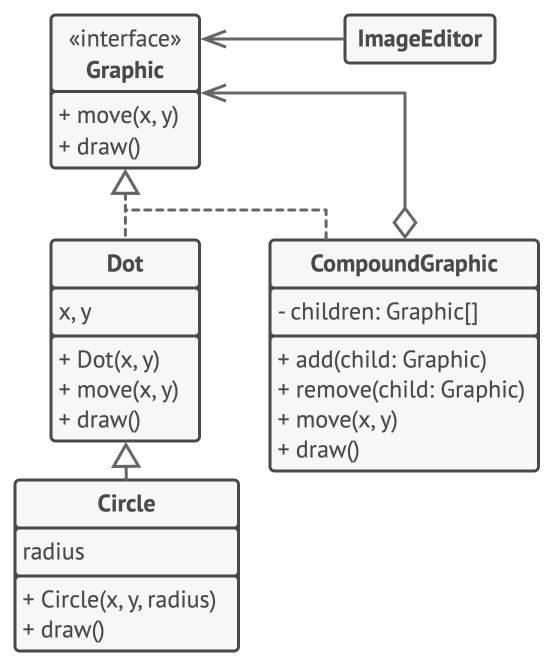
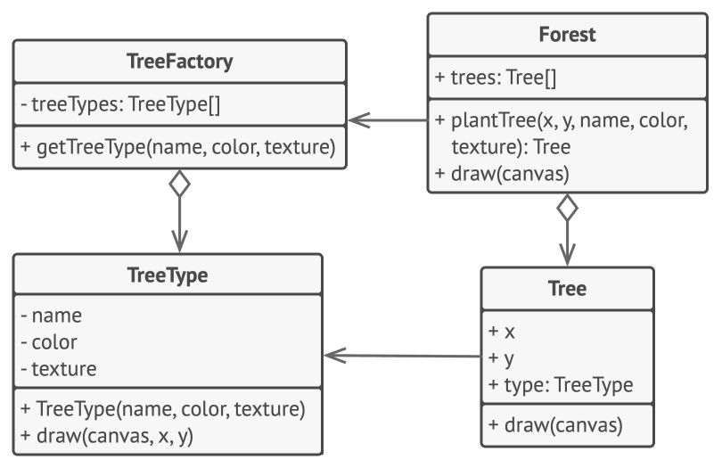

# Design Pattern
## Design pattern là gì?
- *Design pattern* là những giải pháp điển hình cho các vấn đề thường xuyên gặp trong thiết kế phần mềm. Chúng giống như những bản *thiết kế (blueprint)* được làm sẵn mà bạn có thể tùy biến để giải quyết một vấn đề thiết kế lặp đi lặp lại trong chương trình của mình.
- Bạn *không thể chỉ đơn giản lấy một mẫu thiết kế và sao chép nó vào chương trình* như cách làm với các hàm hay thư viện có sẵn. Mẫu thiết kế *không phải là một đoạn mã cụ thể*, mà là một *ý tưởng tổng quát* để giải quyết một vấn đề cụ thể. Bạn cần *hiểu chi tiết mẫu*, rồi triển khai giải pháp phù hợp với thực tế chương trình của mình.
- Design pattern thường bị *nhầm lẫn với thuật toán*, vì cả hai đều mô tả giải pháp cho một vấn đề đã biết. Tuy nhiên:
    - *Thuật toán* luôn chỉ rõ một tập hợp các bước cụ thể để đạt được mục tiêu.
    - *Design pattern* lại là mô tả cấp cao hơn về giải pháp — không nhất thiết có một chuỗi bước cố định.
- Để dễ hình dung:
    - *Thuật toán giống như một công thức nấu ăn*: có các bước rõ ràng để đạt được kết quả mong muốn.
    - *Mẫu thiết kế giống như bản thiết kế kiến trúc*: bạn nhìn thấy được kết quả và đặc điểm chính, nhưng cách thực hiện chi tiết là do bạn quyết định.
### Một mẫu thiết kế gồm những gì?
- Hầu hết các mẫu được mô tả một cách rất chính quy để mọi người có thể tái sử dụng trong nhiều hoàn cảnh. Một mô tả mẫu thiết kế thường gồm các phần sau:
    - *Mục đích (Intent)*: mô tả ngắn gọn vấn đề và giải pháp.
    - *Động cơ (Motivation)*: giải thích sâu hơn vấn đề và cách mà mẫu thiết kế giúp giải quyết.
    - *Cấu trúc các lớp (Structure of classes)*: thể hiện các phần của mẫu và mối quan hệ giữa chúng.
    - *Ví dụ mã nguồn (Code example)*: được viết bằng một ngôn ngữ lập trình phổ biến, giúp dễ hiểu hơn về ý tưởng của mẫu.
    - Một số *bộ sưu tập mẫu* còn liệt kê thêm các thông tin hữu ích khác như:
        - *Tính áp dụng (Applicability)*
        - *Các bước triển khai (Implementation steps)*
        - *Mối liên hệ với các mẫu khác (Relations with other patterns)*

## Lịch sử của các mẫu thiết kế (Design Patterns)
- *Ai là người phát minh ra các mẫu thiết kế?* — Đây là một câu hỏi hay, nhưng không hoàn toàn chính xác. *Mẫu thiết kế không phải là những khái niệm bí ẩn hay quá phức tạp* — thực ra là ngược lại. Chúng là *những giải pháp điển hình cho các vấn đề phổ biến trong thiết kế hướng đối tượng*. Khi một giải pháp nào đó được *lặp đi lặp lại nhiều lần trong các dự án khác nhau*, thì sẽ có người *đặt tên cho nó và mô tả chi tiết giải pháp đó*. Đó chính là cách một mẫu thiết kế được “khám phá”.
..........
## Tại sao nên học các mẫu thiết kế?
- Sự thật là: *bạn hoàn toàn có thể làm lập trình viên nhiều năm mà không hề biết đến bất kỳ mẫu thiết kế nào*. Rất nhiều người đã và đang làm như vậy. Nhưng ngay cả trong trường hợp đó, *bạn có thể đã vô tình áp dụng một số mẫu mà không hề hay biết*. Vậy thì tại sao bạn nên dành thời gian để học chúng?
- *Design Pattern là một bộ công cụ gồm những giải pháp đã được kiểm chứng* cho các vấn đề phổ biến trong thiết kế phần mềm. Ngay cả khi bạn *không trực tiếp gặp các vấn đề đó*, việc biết về các mẫu vẫn *rất hữu ích* vì nó dạy bạn *cách giải quyết nhiều loại vấn đề khác nhau dựa trên nguyên lý thiết kế hướng đối tượng*.
- Ngoài ra, mẫu thiết kế còn giúp hình thành một *ngôn ngữ chung* giữa bạn và đồng đội, giúp *giao tiếp hiệu quả hơn*. Bạn có thể nói:
    - “Cái này dùng Singleton là được rồi.”
- Và mọi người sẽ *hiểu ngay ý tưởng bạn đang muốn nói*. Bạn *không cần giải thích dài dòng* về Singleton nếu tất cả cùng biết mẫu thiết kế đó và tên của nó.
## Criticism of patterns
- *Dường như chỉ có người lười mới chưa từng phê bình mẫu thiết kế*. Hãy cùng điểm qua một số lập luận phổ biến nhất chống lại việc sử dụng các mẫu này.
- *Vá víu cho ngôn ngữ lập trình yếu*
    - Thông thường, *nhu cầu sử dụng mẫu thiết kế xuất hiện khi người ta chọn một ngôn ngữ* hoặc *công nghệ không có đủ mức trừu tượng cần thiết*. Trong trường hợp đó, mẫu thiết kế giống như một *giải pháp chắp vá* (kludge) giúp bổ sung “siêu năng lực” còn thiếu cho ngôn ngữ.
    - Ví dụ: mẫu *Strategy* có thể được *hiện thực rất đơn giản bằng hàm lambda (anonymous function)* trong hầu hết các ngôn ngữ hiện đại ngày nay.
- *Giải pháp thiếu hiệu quả*
    - Mẫu thiết kế cố gắng *hệ thống hóa các cách tiếp cận vốn đã phổ biến*. Tuy nhiên, nhiều người lại *coi việc áp dụng mẫu như một giáo điều* — họ triển khai mẫu một cách máy móc, *theo đúng từng dòng hướng dẫn*, mà *không hề tùy biến cho phù hợp với hoàn cảnh cụ thể của dự án*.
- *Áp dụng không hợp lý*
    -  “Nếu bạn chỉ có một cây búa, mọi thứ đều trông giống như cái đinh.”
    - Đây là vấn đề phổ biến ở *nhiều người mới học về mẫu thiết kế*. Sau khi nắm được các mẫu, họ cố gắng *áp dụng chúng vào mọi tình huống*, kể cả những nơi mà *viết code đơn giản lại là lựa chọn tốt hơn nhiều*.
## Phân loại các mẫu thiết kế (Design Pattern)
- Các mẫu thiết kế khác nhau về *mức độ phức tạp*, *chi tiết mô tả*, và *quy mô áp dụng trong toàn hệ thống*. Một ví dụ dễ hình dung là so sánh với việc *xây dựng đường sá*: bạn có thể làm cho một giao lộ an toàn hơn bằng cách *lắp đèn giao thông*, hoặc xây hẳn một *nút giao nhiều tầng có hầm đi bộ cho người đi bộ*.
- Mẫu cấp thấp: *Idioms*
    - Những mẫu thiết kế *cơ bản và cấp thấp nhất* thường được gọi là *idioms* (thành ngữ lập trình). Chúng thường *chỉ áp dụng cho một ngôn ngữ lập trình cụ thể*.
- Mẫu cấp cao: *Architectural patterns*
    - Ngược lại, *mẫu thiết kế kiến trúc (architectural patterns)* là những mẫu *tổng quát và cấp cao nhất*. Lập trình viên *có thể áp dụng chúng với hầu hết mọi ngôn ngữ*. Khác với các mẫu thông thường,* chúng được dùng để thiết kế kiến trúc cho toàn bộ ứng dụng*.
- Phân loại theo mục đích (Intent)
    - Ngoài ra, *tất cả các mẫu thiết kế đều có thể được phân loại theo mục đích sử dụng*. Cuốn sách này tập trung vào *ba nhóm chính*:
        - *Creational Patterns – Mẫu khởi tạo* → Cung cấp cơ chế tạo đối tượng, giúp *linh hoạt* và *tái sử dụng mã nguồn* một cách hiệu quả hơn.
        - *Structural Patterns – Mẫu cấu trúc* → Giải thích cách *kết hợp các lớp và đối tượng* để tạo thành cấu trúc lớn hơn, nhưng vẫn *giữ được sự linh hoạt và hiệu quả*.
        - *Behavioral Patterns – Mẫu hành vi* → Tập trung vào *giao tiếp hiệu quả và phân chia trách nhiệm giữa các đối tượng* trong hệ thống.

## Danh mục các mẫu thiết kế (Design Pattern Catalog)
### Tổng quan
- *Mẫu khởi tạo (Creational Patterns)*: Nhóm mẫu này cung cấp các cơ chế tạo đối tượng khác nhau, giúp tăng tính *linh hoạt và khả năng tái sử dụng mã nguồn*.
    - Factory Method – Phương thức nhà máy
    - Abstract Factory – Nhà máy trừu tượng
    - Builder – Trình xây dựng
    - Prototype – Nguyên mẫu
    - Singleton – Đơn thể
- *Mẫu cấu trúc (Structural Patterns)*: Nhóm mẫu này giải thích cách kết hợp các lớp và đối tượng để tạo thành cấu trúc lớn hơn mà vẫn đảm bảo   tính linh hoạt và hiệu quả.
    - Adapter – Bộ chuyển đổi
    - Bridge – Cầu nối
    - Composite – Thành phần tổng hợp
    - Decorator – Bộ trang trí
    - Facade – Giao diện đơn giản
    - Flyweight – Trọng lượng nhẹ
    - Proxy – Đại diện
- *Mẫu hành vi (Behavioral Patterns)*: Nhóm mẫu này tập trung vào thuật toán và việc phân chia trách nhiệm giữa các đối tượng.
    - Chain of Responsibility – Chuỗi trách nhiệm
    - Command – Mệnh lệnh
    - Iterator – Bộ lặp
    - Mediator – Trung gian
    - Memento – Ghi nhớ
    - Observer – Quan sát
    - State – Trạng thái
    - Strategy – Chiến lược
    - Template Method – Phương thức khuôn mẫu
    - Visitor – Khách thăm
### Chi Tiết
#### Factory Method – Phương thức nhà máy
- Tên gọi khác: Constructor ảo (Virtual Constructor)
##### Mục đích
- Factory Method là một mẫu thiết kế thuộc nhóm khởi tạo (creational), cung cấp một *giao diện để tạo đối tượng trong lớp cha*, nhưng cho phép *lớp con thay đổi kiểu đối tượng được tạo ra*.
##### Vấn đề
- Hãy tưởng tượng bạn đang xây dựng một ứng dụng quản lý logistics. Phiên bản đầu tiên chỉ hỗ trợ vận chuyển bằng xe tải, nên hầu hết mã nằm trong lớp *Truck*.
- Sau một thời gian, ứng dụng trở nên phổ biến. Hàng ngày, bạn nhận được hàng tá yêu cầu từ các công ty vận tải đường biển muốn tích hợp vào app.
- *Nhưng thêm lớp Ship vào không hề đơn giản* nếu phần còn lại của mã đã bị ràng buộc chặt với lớp *Truck*. Việc thêm tàu thủy yêu cầu sửa rất nhiều chỗ trong toàn bộ mã nguồn, và nếu sau này lại cần thêm phương thức vận chuyển khác, bạn sẽ phải làm lại tất cả lần nữa.
- Kết quả là mã trở nên lộn xộn, đầy các câu lệnh điều kiện *if/else* hoặc *switch*, để điều chỉnh hành vi tùy thuộc vào loại phương tiện.
##### Giải pháp
- *Factory Method* đề xuất: *thay vì gọi trực tiếp new để tạo đối tượng*, bạn nên gọi một *phương thức đặc biệt (factory method)* để tạo đối tượng.
    - Việc gọi new vẫn diễn ra, nhưng nằm bên trong factory method.
- Phương thức này sẽ trả về các đối tượng được gọi là "sản phẩm" (product).
- Lúc đầu, có thể bạn nghĩ điều này là vô ích – chỉ là chuyển chỗ dòng new. Nhưng điều kỳ diệu là: bạn có thể override factory method ở lớp con để tạo các đối tượng khác nhau tùy theo ngữ cảnh.

- Lưu ý:
    - Các lớp con chỉ có thể trả về những loại sản phẩm có cùng interface hoặc lớp cha.
    - Phương thức factory ở lớp cha phải có kiểu trả về là interface hoặc lớp cha đó.
- Ví dụ:
    - Cả Truck và Ship đều thực hiện interface Transport, với phương thức deliver().
    - Truck.deliver() thì vận chuyển qua đường bộ.
    - Ship.deliver() thì vận chuyển qua đường biển.
    - Lớp RoadLogistics trả về Truck, còn SeaLogistics trả về Ship.

- Nhờ có interface Transport, client code có thể làm việc với mọi loại sản phẩm mà không cần biết cụ thể là loại nào.
##### Cấu trúc
- Product: Interface chung cho tất cả sản phẩm.
- ConcreteProduct: Các lớp triển khai Product.
- Creator (Dialog): Khai báo createProduct() (factory method).
- ConcreteCreator (WindowsDialog, WebDialog): Override createProduct() để trả về sản phẩm cụ thể.
-> Creator không phải chỉ để tạo sản phẩm – nó chứa logic nghiệp vụ liên quan đến sản phẩm, và factory method chỉ giúp tách biệt việc tạo sản phẩm khỏi logic sử dụng sản phẩm.

##### Giả mã (Pseudocode)
// Interface sản phẩm
interface Button {
    void render();
    void onClick(Runnable action);
}

// Các sản phẩm cụ thể
class WindowsButton implements Button {
    public void render() { /* Vẽ nút kiểu Windows */ }
    public void onClick(Runnable action) { /* Gắn sự kiện click Windows */ }
}

class HTMLButton implements Button {
    public void render() { /* Trả về HTML button */ }
    public void onClick(Runnable action) { /* Gắn sự kiện click HTML */ }
}

// Creator
abstract class Dialog {
    abstract Button createButton();

    public void render() {
        Button okButton = createButton();
        okButton.onClick(() -> closeDialog());
        okButton.render();
    }

    void closeDialog() { /* Đóng dialog */ }
}

// Concrete Creators
class WindowsDialog extends Dialog {
    Button createButton() { return new WindowsButton(); }
}

class WebDialog extends Dialog {
    Button createButton() { return new HTMLButton(); }
}

// Ứng dụng
class Application {
    Dialog dialog;

    void initialize() {
        String os = System.getenv("APP_OS");
        if (os.equals("Windows")) dialog = new WindowsDialog();
        else if (os.equals("Web")) dialog = new WebDialog();
        else throw new RuntimeException("Unsupported OS");
    }

    void main() {
        initialize();
        dialog.render();
    }
}
##### Khi nào sử dụng Factory Method?
- Khi bạn không biết trước kiểu và phụ thuộc của đối tượng cần tạo
- Khi muốn tách riêng việc tạo đối tượng khỏi logic sử dụng đối tượng
- Khi muốn cung cấp cơ chế mở rộng cho framework hoặc thư viện
- Khi muốn tái sử dụng tài nguyên (pool object) thay vì tạo mới mỗi lần
##### Triển khai thế nào?
- Tạo interface chung cho tất cả các sản phẩm.
- Thêm phương thức factory vào lớp Creator.
- Tìm tất cả nơi đang gọi new, thay bằng gọi factory.
- Tạo các lớp Creator con và override factory method.
- Có thể dùng tham số truyền vào factory method nếu có nhiều loại sản phẩm.
- Nếu factory ở lớp cha rỗng, có thể biến nó thành abstract.
##### Ưu điểm
- Tránh ràng buộc chặt giữa Creator và sản phẩm cụ thể.
- Tuân thủ Nguyên lý Trách nhiệm đơn (SRP): gom code tạo đối tượng vào 1 nơi.
- Tuân thủ Nguyên lý Mở-Đóng (OCP): thêm sản phẩm mới mà không sửa client code.
#####  Nhược điểm
- Tăng số lượng lớp trong hệ thống.
- Code ban đầu có thể phức tạp hơn một chút.
##### Quan hệ với các mẫu khác
| Mẫu                  | Mối quan hệ                                 |
| -------------------- | ------------------------------------------- |
| **Abstract Factory** | Thường xây dựng từ nhiều Factory Method     |
| **Prototype**        | Có thể dùng thay thế nếu không muốn kế thừa |
| **Builder**          | Tùy biến cao hơn, nhưng phức tạp hơn        |
| **Template Method**  | Factory Method là một bước trong Template   |

#### Abstract Factory – Nhà máy trừu tượng
##### Mục đích
- Abstract Factory là một mẫu thiết kế thuộc nhóm khởi tạo (creational), cho phép bạn tạo ra một họ các đối tượng liên quan mà không cần chỉ rõ lớp cụ thể của chúng.
##### Vấn đề
- Hãy tưởng tượng bạn đang xây dựng một ứng dụng mô phỏng cửa hàng nội thất. Mã của bạn bao gồm các lớp đại diện cho:
    - Một họ sản phẩm gồm: Chair, Sofa, CoffeeTable
    - Nhiều biến thể của họ sản phẩm này: Modern, Victorian, ArtDeco

- Khách hàng rất khó chịu nếu nhận được nội thất không đồng bộ – ví dụ ghế phong cách Victorian mà đi với bàn hiện đại.
- Ngoài ra, bạn không muốn sửa mã hiện tại mỗi lần thêm loại nội thất mới. Danh mục nội thất thường xuyên cập nhật, và bạn cần giải pháp mở rộng không ảnh hưởng đến phần lõi.
#####  Giải pháp
- Abstract Factory đề xuất:
    - Tạo interface trừu tượng cho mỗi loại sản phẩm (Chair, Sofa, CoffeeTable)
    - Mỗi biến thể (ModernChair, VictorianSofa,...) sẽ triển khai các interface đó
    - Tạo interface AbstractFactory gồm các phương thức như createChair(), createSofa(), v.v.
    - Mỗi biến thể có một Concrete Factory, ví dụ ModernFurnitureFactory tạo ModernChair, ModernSofa,...
- Client chỉ làm việc với interface trừu tượng, nên bạn có thể thay đổi factory được cung cấp mà không cần sửa client.
##### Cấu trúc
- Abstract Products: Chair, Sofa, CoffeeTable – interface trừu tượng
- Concrete Products: Các lớp cụ thể như ModernChair, VictorianSofa,…
- Abstract Factory: Interface FurnitureFactory với các phương thức createChair(), createSofa()…
- Concrete Factories: Ví dụ ModernFurnitureFactory, VictorianFurnitureFactory

- Các Concrete Factory phải trả về kiểu interface (không phải kiểu cụ thể), giúp client code không bị ràng buộc.
##### Giả mã (Pseudocode)
// Abstract Product: Button
interface Button {
    void paint();
}

// Abstract Product: Checkbox
interface Checkbox {
    void paint();
}

// Concrete Product: Windows
class WinButton implements Button {
    public void paint() { /* Vẽ nút kiểu Windows */ }
}
class WinCheckbox implements Checkbox {
    public void paint() { /* Vẽ checkbox kiểu Windows */ }
}

// Concrete Product: Mac
class MacButton implements Button {
    public void paint() { /* Vẽ nút kiểu macOS */ }
}
class MacCheckbox implements Checkbox {
    public void paint() { /* Vẽ checkbox kiểu macOS */ }
}

// Abstract Factory
interface GUIFactory {
    Button createButton();
    Checkbox createCheckbox();
}

// Concrete Factory: Windows
class WinFactory implements GUIFactory {
    public Button createButton() { return new WinButton(); }
    public Checkbox createCheckbox() { return new WinCheckbox(); }
}

// Concrete Factory: Mac
class MacFactory implements GUIFactory {
    public Button createButton() { return new MacButton(); }
    public Checkbox createCheckbox() { return new MacCheckbox(); }
}

// Client
class Application {
    private GUIFactory factory;
    private Button button;

    public Application(GUIFactory factory) {
        this.factory = factory;
    }

    public void createUI() {
        button = factory.createButton();
    }

    public void paint() {
        button.paint();
    }
}

// Khởi tạo
class ApplicationConfigurator {
    public static void main(String[] args) {
        GUIFactory factory;
        String os = System.getenv("APP_OS");

        if (os.equals("Windows")) {
            factory = new WinFactory();
        } else if (os.equals("Mac")) {
            factory = new MacFactory();
        } else {
            throw new RuntimeException("Unsupported OS");
        }

        Application app = new Application(factory);
        app.createUI();
        app.paint();
    }
}
##### Khi nào nên dùng Abstract Factory?
- Khi ứng dụng cần làm việc với nhiều họ sản phẩm liên quan
- Khi bạn muốn tách biệt client code khỏi các lớp sản phẩm cụ thể
- Khi bạn muốn hỗ trợ mở rộng sản phẩm trong tương lai mà không phá vỡ mã hiện tại
-> Ví dụ: bạn có thể thêm ArtDecoFactory và các sản phẩm ArtDecoChair,… mà không sửa mã client.
##### Cách triển khai
- Vẽ ma trận: các loại sản phẩm × biến thể
- Tạo các interface trừu tượng cho từng loại sản phẩm
- Tạo interface AbstractFactory với các phương thức khởi tạo
- Cài đặt các Concrete Factory cho mỗi biến thể
- Ở phần khởi tạo app, chọn đúng factory tùy theo cấu hình
- Thay tất cả new bằng factory.createX()
##### Ưu điểm
- Tạo ra các đối tượng tương thích đồng bộ
- Tránh ràng buộc chặt giữa client và sản phẩm cụ thể
- SRP: gom code tạo sản phẩm về 1 nơi
- OCP: dễ mở rộng thêm biến thể mới
##### Nhược điểm
- Mã phức tạp hơn do có nhiều interface và lớp mới
##### Quan hệ với các mẫu khác
| Mẫu                | Quan hệ                                                  |
| ------------------ | -------------------------------------------------------- |
| **Factory Method** | Abstract Factory thường được xây từ nhiều Factory Method |
| **Builder**        | Tạo đối tượng từng bước (phức tạp hơn)                   |
| **Prototype**      | Dùng clone thay vì tạo mới                               |
| **Facade**         | Abstract Factory có thể ẩn quá trình tạo đối tượng       |
| **Bridge**         | Abstract Factory có thể cấp implementation cho Bridge    |
| **Singleton**      | Abstract Factory có thể được cài theo Singleton          |

#### Builder Pattern
##### Mục đích
- Builder là một mẫu thiết kế thuộc nhóm khởi tạo (creational design pattern), cho phép bạn tạo ra các đối tượng phức tạp từng bước một. Mẫu này cho phép bạn tạo ra nhiều dạng và biểu diễn khác nhau của một đối tượng bằng cùng một đoạn mã xây dựng.
##### Vấn đề
- Hãy tưởng tượng bạn cần tạo một đối tượng phức tạp, yêu cầu khởi tạo từng bước với nhiều thuộc tính và đối tượng lồng nhau. Việc khởi tạo này thường nằm trong một constructor “quái vật” với hàng tá tham số, hoặc tệ hơn là bị rải rác khắp nơi trong code client.
- Tạo quá nhiều subclass
    - Giả sử bạn cần tạo một đối tượng House. Ngôi nhà đơn giản gồm: 4 bức tường, sàn, cửa, 2 cửa sổ và mái. Nhưng nếu bạn cần một biệt thự có sân vườn, hệ thống sưởi, nước và điện?
        - Cách đơn giản là tạo nhiều subclass để bao phủ mọi tổ hợp cấu hình nhà.
        - Nhưng điều đó dẫn tới một cây thừa kế khổng lồ, mỗi lần thêm tùy chọn (như kiểu hiên) bạn lại phải mở rộng hierarchy.
- Constructor quá tải (Telescoping Constructor)
    - Một cách khác là nhồi tất cả tham số vào một constructor khổng lồ:
        new House(4, 1, 1, 2, 1, true, false, true, true, false, ...)
        - Gây khó đọc, dễ nhầm
        - Đa phần tham số thường không dùng

##### Giải pháp
- Builder pattern đề xuất: Tách mã xây dựng đối tượng khỏi lớp chính và chuyển nó vào một lớp riêng gọi là Builder.
- Cách hoạt động:
    - Mỗi bước xây dựng như buildWalls(), buildDoor()... được định nghĩa trong builder
    - Bạn gọi tuần tự các bước cần thiết để xây dựng cấu hình mong muốn
    - Không cần gọi tất cả – chỉ gọi những bước cần thiết
- Nhiều Builder cho nhiều dạng biểu diễn
- Ví dụ:
    - Builder 1 xây dựng từ gỗ và kính → nhà thường
    - Builder 2 xây từ đá và sắt → lâu đài
    - Builder 3 dùng vàng và kim cương → cung điện
-> Tất cả dùng cùng một chuỗi bước, nhưng mỗi builder thực thi theo cách riêng
- Director
    - Một lớp Director có thể điều phối thứ tự gọi các bước của Builder:
        - Client chỉ cần truyền Builder vào Director
        - Director gọi các bước theo trình tự để tạo sản phẩm cụ thể
        - Client nhận kết quả từ builder
    - Director không bắt buộc phải có, nhưng giúp tái sử dụng logic xây dựng.

##### Cấu trúc (Structure)
- Builder (interface): Khai báo các bước xây dựng sản phẩm
- Concrete Builder: Cài đặt chi tiết các bước đó
- Product: Kết quả cuối cùng (có thể không cùng class/interface)
- Director: Quy định thứ tự gọi các bước để tạo cấu hình cụ thể
- Client: Truyền builder vào director, gọi xây dựng, và lấy kết quả từ builder

##### Mã giả (Pseudocode)

##### Khi nào nên dùng Builder?
- Bạn muốn tránh telescoping constructor
- Bạn muốn cấu hình linh hoạt (chỉ gọi bước cần thiết)
- Bạn muốn tạo nhiều biểu diễn khác nhau của một sản phẩm
- Bạn đang xây dựng cây đối tượng phức tạp (Composite)
- Bạn muốn giấu quá trình khởi tạo khỏi client
##### Cách triển khai
- Xác định rõ các bước chung để xây dựng sản phẩm
- Định nghĩa interface Builder chứa các bước đó
- Tạo các ConcreteBuilder cho từng kiểu biểu diễn
- Tạo phương thức getResult() trong builder để trả về kết quả
- (Tùy chọn) Tạo class Director điều phối thứ tự gọi các bước
- Client:
    - Tạo builder và director
    - Truyền builder cho director
    - Gọi hàm dựng và lấy kết quả từ builder

##### Ưu điểm
- Xây dựng sản phẩm từng bước
- Có thể trì hoãn hoặc gọi đệ quy các bước
- Tái sử dụng cùng logic cho nhiều sản phẩm khác nhau
- Tuân thủ Single Responsibility Principle – tách riêng logic xây dựng
- Dễ bảo trì và mở rộng
##### Nhược điểm
- Tăng độ phức tạp do phải tạo nhiều class mới
##### Quan hệ với các mẫu khác
- Factory Method: thường là bước khởi đầu → nâng cấp lên Builder khi cần linh hoạt hơn
- Abstract Factory: tạo họ sản phẩm → Builder tạo từng phần của 1 sản phẩm phức tạp
- Prototype: tạo bản sao → Builder xây dựng từ đầu
- Bridge: Builder có thể là implementor, Director là abstraction
- Composite: có thể dùng Builder để xây cây phức tạp
- Singleton: Builder có thể được triển khai theo kiểu Singleton

#### Prototype Pattern (Nguyên mẫu) - Tên gọi khác: Clone (Sao chép)
#####  Mục đích
- Prototype là một mẫu thiết kế thuộc nhóm khởi tạo (creational pattern), cho phép bạn sao chép các đối tượng hiện có mà không phụ thuộc vào lớp cụ thể của chúng.
##### Vấn đề
- Giả sử bạn có một đối tượng và muốn tạo một bản sao y hệt. Cách thông thường:
    - Tạo một đối tượng mới cùng lớp.
    - Sao chép từng trường (field) từ đối tượng gốc sang đối tượng mới.
- Nhưng có vấn đề:
    - Một số field là private, không thể truy cập từ bên ngoài.
    - Bạn phải biết trước lớp cụ thể để tạo ra đối tượng mới → khiến code bị phụ thuộc vào lớp.
    - Nhiều khi bạn chỉ có interface, không biết class thật.
##### Giải pháp
- Mẫu Prototype giao việc sao chép (clone) cho chính đối tượng được sao chép.
- Cách hoạt động:
    - Tạo một interface chung với phương thức clone()
    - Mỗi lớp cài đặt clone() bằng cách:
        - Tạo bản sao mới
        - Sao chép tất cả dữ liệu (kể cả private, vì cùng lớp)
    - Kết quả: Có thể sao chép đối tượng mà không cần biết lớp cụ thể.
- Một đối tượng có thể clone chính nó được gọi là prototype.
##### Ví dụ thực tế
- Nguyên mẫu trong công nghiệp:
    - Dùng để thử nghiệm trước khi sản xuất hàng loạt.
    - Tuy nhiên, các nguyên mẫu này không tự sao chép được.
- Tế bào sinh học:
    - Quá trình phân bào nguyên phân (mitosis) là hình ảnh sát nhất.
    - Tế bào mẹ tạo ra bản sao y hệt của chính nó.
##### Cấu trúc
- Basic
    - Prototype Interface: Khai báo phương thức clone()
    - Concrete Prototype: Cài đặt clone, xử lý sao chép (kể cả đối tượng liên kết, phụ thuộc đệ quy…)
    - Client: Gọi clone() mà không cần biết class thật
- Registry (Danh mục nguyên mẫu)
    - Một kho lưu trữ các đối tượng cấu hình sẵn
    - Dạng đơn giản: HashMap<String, Prototype>
    - Khi cần, chỉ việc tìm prototype phù hợp và gọi clone()
##### Mã giả (Pseudocode)
- Giả sử bạn có một hệ thống hình học với Shape, Circle, Rectangle:
abstract class Shape {
    int x, y;
    String color;

    Shape() {}
    Shape(Shape source) {
        this.x = source.x;
        this.y = source.y;
        this.color = source.color;
    }

    abstract Shape clone();
}

class Rectangle extends Shape {
    int width, height;

    Rectangle(Rectangle source) {
        super(source);
        this.width = source.width;
        this.height = source.height;
    }

    Shape clone() {
        return new Rectangle(this);
    }
}

class Circle extends Shape {
    int radius;

    Circle(Circle source) {
        super(source);
        this.radius = source.radius;
    }

    Shape clone() {
        return new Circle(this);
    }
}
##### Khi nào dùng Prototype?
- Khi bạn muốn sao chép đối tượng mà không phụ thuộc vào lớp cụ thể
    - Thường xảy ra khi nhận object từ thư viện bên ngoài
    - Bạn chỉ có interface, không có class
- Khi bạn muốn giảm số lượng subclass
    - Một số class phức tạp cần cấu hình nặng trước khi dùng
    - Bạn thường tạo nhiều subclass chỉ để cài đặt cấu hình
    - Dùng prototype: tạo 1 đối tượng cấu hình sẵn → clone
##### Cách triển khai
- Tạo interface Prototype với clone()
- Mỗi class:
    - Tạo constructor đặc biệt nhận 1 object cùng kiểu
    - Trong đó copy toàn bộ field (gồm private)
    - Override clone() → trả về new Class(this)
- (Tùy chọn) Tạo PrototypeRegistry chứa các nguyên mẫu
    - Có thể là static Map<String, Prototype>
    - Khi client cần → tìm & clone
- Client chỉ cần gọi clone(), không cần new
##### Ưu điểm
- Không phụ thuộc lớp cụ thể
- Tái sử dụng đối tượng cấu hình sẵn
- Tạo object nhanh, tiện
- Thay thế cho kế thừa trong nhiều trường hợp
##### Nhược điểm
- Sao chép các đối tượng phức tạp có vòng lặp (circular reference) rất khó xử lý
- Có thể dẫn đến lỗi tham chiếu sâu/nhẹ (deep vs shallow clone) nếu không cẩn thận
##### Quan hệ với các mẫu khác
| Liên quan đến            | Ghi chú                                                                            |
| ------------------------ | ---------------------------------------------------------------------------------- |
| **Factory Method**       | Prototype là bước phát triển từ Factory Method, phù hợp khi đối tượng quá phức tạp |
| **Abstract Factory**     | Có thể dùng Prototype để triển khai các method tạo object                          |
| **Command**              | Prototype dùng để lưu bản sao command vào history                                  |
| **Composite, Decorator** | Prototype rất hữu ích khi clone cây phức tạp                                       |
| **Memento**              | Prototype có thể thay thế Memento nếu object đơn giản                              |
| **Singleton**            | Prototype có thể là singleton nếu cần                                              |

#### Singleton Pattern (Đơn thể)
#####  Mục đích
- Singleton là một mẫu thiết kế thuộc nhóm khởi tạo (Creational Design Pattern), cho phép bạn đảm bảo rằng một lớp chỉ có một thể hiện duy nhất, đồng thời cung cấp một điểm truy cập toàn cục (global access point) đến thể hiện đó.
##### Vấn đề
- Mẫu Singleton giải quyết hai vấn đề cùng lúc, điều này cũng là lý do vì sao nó vi phạm Nguyên lý Trách nhiệm Duy nhất (Single Responsibility Principle):
    - Đảm bảo một lớp chỉ có một thể hiện duy nhất.
        - Tại sao phải kiểm soát số lượng thể hiện?
            → Thường để quản lý tài nguyên dùng chung, như kết nối CSDL, file, v.v.
        - Khi bạn tạo một đối tượng mới, hệ thống sẽ không thực sự tạo mới, mà trả về thể hiện đã có sẵn.
        - Lưu ý: Điều này không thể thực hiện với constructor thông thường vì new luôn trả về một đối tượng mới.
    - Cung cấp điểm truy cập toàn cục tới thể hiện đó.
        - Giống như biến toàn cục nhưng an toàn hơn: các phần khác của hệ thống không thể ghi đè đối tượng này.

##### Giải pháp
Tất cả các triển khai Singleton đều tuân theo 2 bước chính:
- Ẩn constructor mặc định (đặt là private) → ngăn không cho tạo mới đối tượng bằng new.
- Tạo một phương thức tĩnh (static) để khởi tạo hoặc trả về thể hiện duy nhất.
→ Phương thức này chỉ tạo mới khi lần đầu được gọi (lazy initialization), sau đó sẽ trả về thể hiện đã tạo.
##### Ví dụ thực tế
Chính phủ là một ví dụ điển hình của Singleton:
- Mỗi quốc gia chỉ có một chính phủ hợp pháp.
- Dù người điều hành thay đổi, “Chính phủ nước X” vẫn là một điểm truy cập duy nhất đại diện cho bộ máy lãnh đạo.
##### Cấu trúc
- Lớp Singleton khai báo một phương thức tĩnh getInstance(), trả về thể hiện duy nhất.
- Constructor bị ẩn (private), chỉ có thể được gọi bên trong lớp.
- Mọi nơi trong chương trình muốn dùng đối tượng đều gọi getInstance().
##### Mã giả (Pseudocode)
class Database is
    private static field instance: Database

    private constructor Database() is
        // Khởi tạo kết nối tới server CSDL, v.v.

    public static method getInstance() is
        if (Database.instance == null) then
            acquireThreadLock()
            if (Database.instance == null) then
                Database.instance = new Database()
        return Database.instance

    public method query(sql) is
        // Gửi truy vấn đến CSDL
class Application is
    method main() is
        Database foo = Database.getInstance()
        foo.query("SELECT ...")

        Database bar = Database.getInstance()
        bar.query("SELECT ...")
        // foo và bar là cùng một đối tượng
##### Khi nào sử dụng Singleton?
- Khi bạn cần một đối tượng duy nhất trong toàn hệ thống
    - Ví dụ: Logger, Config, Database, Thread Pool...
- Khi bạn cần kiểm soát chặt chẽ biến toàn cục
    - Singleton an toàn hơn biến toàn cục vì không thể bị ghi đè.

##### Cách triển khai
- Thêm biến tĩnh private trong lớp để lưu thể hiện duy nhất.
- Tạo phương thức tĩnh công khai getInstance() để truy cập đối tượng.
- Trong getInstance():
    - Nếu đối tượng chưa tồn tại → tạo mới.
    - Nếu đã tồn tại → trả về.
- Ẩn constructor bằng cách đặt là private.
- Trong code client, thay mọi new Singleton() bằng Singleton.getInstance().
##### Ưu điểm
- Đảm bảo chỉ có một thể hiện của lớp
- Có điểm truy cập toàn cục, tiện sử dụng
- Khởi tạo trễ → chỉ tạo khi cần
##### Nhược điểm
- Vi phạm Nguyên lý Trách nhiệm Duy nhất (vừa kiểm soát instance, vừa cung cấp logic)
- Có thể che giấu thiết kế tệ, khiến các phần biết quá nhiều về nhau
- Trong môi trường đa luồng, cần xử lý đồng bộ kỹ để tránh tạo nhiều đối tượng
- Khó kiểm thử unit test, vì:
    - Constructor bị private
    - Không thể mock static method dễ dàng
#####  Quan hệ với các mẫu khác
| Mẫu liên quan                                    | Quan hệ                                                                                       |
| ------------------------------------------------ | --------------------------------------------------------------------------------------------- |
| **Facade**                                       | Thường có thể biến thành Singleton, vì chỉ cần một facade là đủ.                              |
| **Flyweight**                                    | Giống Singleton nếu chỉ có một trạng thái dùng chung, nhưng:                                  |
|                                                  | → Singleton có đúng **1 instance**, Flyweight có **nhiều instance** với trạng thái khác nhau. |
|                                                  | → Singleton có thể mutable, Flyweight thường immutable.                                       |
| **Abstract Factory**, **Builder**, **Prototype** | Đều có thể được cài đặt theo kiểu Singleton.                                                  |

####  Adapter Pattern (Bộ chuyển đổi) - Tên gọi khác: Wrapper (Bọc ngoài)
##### Mục đích
- Adapter là một mẫu thiết kế cấu trúc (Structural Design Pattern) cho phép các đối tượng với giao diện không tương thích có thể làm việc cùng nhau.
##### Vấn đề
- Hãy tưởng tượng bạn đang xây dựng một ứng dụng theo dõi thị trường chứng khoán. Ứng dụng này tải dữ liệu từ nhiều nguồn khác nhau ở định dạng XML, rồi hiển thị biểu đồ đẹp mắt cho người dùng.
- Sau đó, bạn muốn tích hợp một thư viện phân tích thông minh từ bên thứ ba. Tuy nhiên, thư viện này chỉ chấp nhận dữ liệu ở định dạng JSON.
- Nếu bạn chỉnh sửa thư viện để xử lý XML → rất rủi ro:
    - Có thể phá vỡ các mã khác đang dùng thư viện đó.
    - Tệ hơn, bạn có thể không có quyền truy cập mã nguồn của thư viện.
##### Giải pháp
- Tạo ra một adapter (bộ chuyển đổi):
→ Đây là một đối tượng đặc biệt giúp chuyển đổi giao diện của một đối tượng này thành dạng mà đối tượng khác có thể hiểu được.
- Adapter bọc quanh đối tượng gốc, xử lý việc chuyển đổi bên trong mà đối tượng gốc không hề hay biết.
- Ví dụ: Adapter có thể bọc một đối tượng đo bằng mét và km, rồi chuyển nó thành feet và dặm cho bên nhận.
- Adapter có thể:
    - Chuyển đổi định dạng dữ liệu.
    - Cho phép các đối tượng có giao diện khác nhau có thể tương tác.

##### Cách hoạt động
- Adapter cung cấp một giao diện tương thích với phía client.
- Client gọi các phương thức adapter như thể đang dùng đối tượng phù hợp.
- Adapter nhận lời gọi và chuyển đổi thành lời gọi đúng định dạng cho đối tượng thật sự bên trong.
- Thậm chí có thể tạo adapter 2 chiều nếu cần chuyển đổi theo cả 2 hướng.
#####  Ví dụ thực tế
- Bạn du lịch từ Mỹ sang Đức. Ổ điện ở Đức không khớp với phích cắm Mỹ.
→ Bạn cần một bộ chuyển đổi phích cắm (adapter) giữa tiêu chuẩn Mỹ và Châu Âu.
→ Tương tự, mẫu Adapter giúp kết nối hai thứ không tương thích.
##### Cấu trúc
- Adapter đối tượng (Object Adapter)
    - Dựa trên nguyên lý composition (thành phần).
    - Adapter triển khai giao diện của client, bọc lấy đối tượng service.
- Thành phần:
    - Client: Chứa logic chính của ứng dụng.
    - Client Interface: Mô tả giao diện mà client mong đợi.
    - Service: Lớp có ích nhưng có giao diện không tương thích.
    - Adapter: Triển khai Client Interface và bọc Service → dịch lệnh từ Client sang Service.
    -> Ưu điểm: Không phụ thuộc vào adapter cụ thể → dễ thay thế adapter khác.
- Adapter lớp (Class Adapter)
    - Dựa trên kế thừa, adapter kế thừa từ cả Client Interface và Service.
    - Chỉ áp dụng được với ngôn ngữ hỗ trợ đa kế thừa (vd: C++).
##### Mã giả
- Ví dụ cổ điển: lỗ tròn & chốt vuông. Làm sao để cắm chốt vuông vào lỗ tròn?
class RoundHole is
    constructor RoundHole(radius)
    method getRadius()
    method fits(peg: RoundPeg) is
        return this.getRadius() >= peg.getRadius()

class RoundPeg is
    constructor RoundPeg(radius)
    method getRadius()

class SquarePeg is
    constructor SquarePeg(width)
    method getWidth()

class SquarePegAdapter extends RoundPeg is
    private field peg: SquarePeg
    constructor SquarePegAdapter(peg: SquarePeg)
        this.peg = peg
    method getRadius() is
        return peg.getWidth() * sqrt(2) / 2

// Client code
hole = new RoundHole(5)
rpeg = new RoundPeg(5)
hole.fits(rpeg) // true

small_sqpeg = new SquarePeg(5)
large_sqpeg = new SquarePeg(10)
// hole.fits(small_sqpeg) // lỗi vì không khớp kiểu

small_adapter = new SquarePegAdapter(small_sqpeg)
large_adapter = new SquarePegAdapter(large_sqpeg)
hole.fits(small_adapter) // true
hole.fits(large_adapter) // false
##### Khi nào nên dùng Adapter?
- Khi bạn muốn sử dụng một lớp đã tồn tại, nhưng giao diện của nó không tương thích với hệ thống của bạn.
-  Khi bạn muốn tái sử dụng các lớp con hiện có nhưng chúng thiếu một số tính năng và bạn không thể thêm vào lớp cha.
→ Thay vì kế thừa → bạn bọc lớp con trong Adapter, thêm tính năng mới mà không cần sửa mã gốc.
##### Cách triển khai
- Xác định 2 lớp có giao diện không tương thích:
    - Service: lớp cần dùng (không thể sửa).
    - Client: phần còn lại của chương trình.
- Tạo Adapter class, triển khai giao diện client.
- Thêm một trường tham chiếu đến service trong adapter (thường truyền qua constructor).
- Triển khai từng phương thức client interface bằng cách gọi phương thức tương ứng của service, và chuyển đổi dữ liệu nếu cần.
- Dùng adapter thông qua giao diện client, giúp dễ dàng thay thế adapter khác mà không sửa code client.
##### Ưu điểm
- Tuân thủ Nguyên lý Trách nhiệm Duy nhất (SRP): tách biệt phần chuyển đổi giao diện khỏi logic chính
- Tuân thủ Nguyên lý Mở/Đóng (OCP): dễ mở rộng thêm adapter mà không ảnh hưởng code cũ
- Giúp tái sử dụng các lớp cũ/thư viện ngoài một cách an toàn và linh hoạt
##### Nhược điểm
- Tăng độ phức tạp của hệ thống → cần tạo thêm lớp, giao diện
- Đôi khi sửa trực tiếp lớp service lại đơn giản hơn (nếu có thể)
##### Quan hệ với các mẫu khác
| Mẫu thiết kế        | So sánh với Adapter                                                               |
| ------------------- | --------------------------------------------------------------------------------- |
| **Bridge**          | Thiết kế trước để các phần ứng dụng phát triển độc lập                            |
| **Adapter**         | Dùng khi đã có hệ thống sẵn, cần giúp các lớp không tương thích làm việc          |
| **Decorator**       | Không thay đổi giao diện, chỉ mở rộng tính năng (có thể đệ quy)                   |
| **Proxy**           | Giao diện giữ nguyên, chỉ thêm kiểm soát                                          |
| **Facade**          | Tạo giao diện **mới**, còn Adapter chỉ làm cho giao diện **hiện tại có thể dùng** |
| **Strategy, State** | Có cấu trúc tương tự Adapter (dựa trên composition), nhưng giải quyết vấn đề khác |

#### Bridge Pattern (Cầu nối)
##### Mục đích
- Bridge là một mẫu thiết kế cấu trúc (Structural Design Pattern) cho phép bạn tách một lớp lớn hoặc một nhóm lớp liên quan chặt chẽ thành hai hệ phân cấp riêng biệt—trừu tượng (abstraction) và triển khai (implementation)—có thể phát triển độc lập với nhau.
##### Vấn đề
- Bạn có một lớp Shape với hai lớp con: Circle và Square.
- Bây giờ bạn muốn thêm màu sắc vào các hình này, nên bạn định tạo thêm các lớp RedCircle, BlueSquare, v.v.
- Vấn đề: Với mỗi loại hình và màu, bạn phải tạo mọi tổ hợp có thể, ví dụ:
    - 2 hình × 2 màu → 4 lớp
    - Thêm 1 hình → 6 lớp
    - Thêm 1 màu nữa → 9 lớp
    → Tăng theo cấp số nhân.
##### Giải pháp
- Lý do là bạn đang kế thừa theo 2 chiều độc lập: hình dạng và màu sắc.
→ Mẫu Bridge đề xuất chuyển từ kế thừa sang composition (thành phần).
- Tách một chiều ra thành hệ phân cấp riêng, lớp chính sẽ tham chiếu đến đối tượng triển khai thay vì chứa toàn bộ logic.
- Ví dụ:
    - Tách Color thành Red và Blue.
    - Lớp Shape chứa một tham chiếu đến Color.
    - Khi cần hiển thị màu, Shape ủy nhiệm cho Color.
→ Giờ đây, bạn có thể thêm hình hoặc màu mà không làm thay đổi hệ phân cấp còn lại.
##### Giải thích thuật ngữ
- Trong sách GoF:
    - Abstraction (Trừu tượng): lớp điều khiển ở tầng cao, không tự thực thi mà ủy thác cho implementation.
    - Implementation (Triển khai): lớp thực hiện chi tiết logic ở tầng thấp.
-  Lưu ý: đây *không phải là interface hay abstract class trong ngôn ngữ lập trình.
- Ví dụ thực tế:
    - Abstraction: Giao diện người dùng (GUI).
    - Implementation: Giao diện hệ điều hành (API).
    → Bạn có thể:
    - Có nhiều GUI (cho admin, user…)
    - Có nhiều hệ điều hành (Windows, Linux…)
- Mỗi tổ hợp GUI + OS = 1 cấu hình
→ Nếu không dùng Bridge, bạn sẽ có một "bát mì spaghetti" với hàng trăm câu lệnh if.
##### Cách hoạt động
- Abstraction (ví dụ: RemoteControl) chứa logic điều khiển chung và tham chiếu đến một đối tượng Implementation (ví dụ: Device).
- Implementation định nghĩa các phương thức cơ bản (bật/tắt, âm lượng, kênh...).
- Refined Abstraction mở rộng thêm logic nâng cao (như mute).
- Client chỉ tương tác với Abstraction, và cung cấp Implementation khi khởi tạo.
##### Mã giả (Pseudocode)
class RemoteControl is
    protected field device: Device
    constructor RemoteControl(device: Device)
        this.device = device

    method togglePower() is
        if (device.isEnabled()) then device.disable()
        else device.enable()

    method volumeDown() is
        device.setVolume(device.getVolume() - 10)

    method volumeUp() is
        device.setVolume(device.getVolume() + 10)

    method channelDown() is
        device.setChannel(device.getChannel() - 1)

    method channelUp() is
        device.setChannel(device.getChannel() + 1)

class AdvancedRemoteControl extends RemoteControl is
    method mute() is
        device.setVolume(0)

interface Device is
    method isEnabled()
    method enable()
    method disable()
    method getVolume()
    method setVolume(percent)
    method getChannel()
    method setChannel(channel)

class Tv implements Device is
    // triển khai các phương thức...

class Radio implements Device is
    // triển khai các phương thức...

// Code sử dụng:
tv = new Tv()
remote = new RemoteControl(tv)
remote.togglePower()

radio = new Radio()
remote = new AdvancedRemoteControl(radio)
remote.mute()
#####  Khi nào dùng Bridge?
- Khi bạn muốn chia nhỏ một lớp đơn khối (monolithic) có nhiều chức năng/phương thức khác nhau (VD: làm việc với nhiều loại CSDL).
- Khi bạn cần mở rộng một lớp theo nhiều chiều độc lập (VD: frontend/backend, giao diện/triển khai).
- Khi bạn cần hoán đổi triển khai lúc runtime.
→ Gán lại đối tượng Implementation trong Abstraction → cực kỳ linh hoạt.
##### Cách triển khai
- Xác định các chiều độc lập trong lớp hiện tại.
- Tạo lớp Abstraction chứa các phương thức chính cần cho client.
- Tạo interface Implementation chứa các thao tác cơ bản mà Abstraction cần.
- Viết các lớp cụ thể ConcreteImplementation (VD: Tv, Radio...).
- Trong Abstraction, thêm thuộc tính tham chiếu đến Implementation.
- Nếu cần, mở rộng các lớp Abstraction thành RefinedAbstraction.
- Client tạo ra cả hai và truyền Implementation vào Abstraction thông qua constructor.
##### Ưu điểm
- Tạo ra các lớp độc lập nền tảng (platform-independent).
- Tuân thủ Nguyên lý Mở/Đóng: thêm abstraction hoặc implementation mới dễ dàng.
- Tuân thủ Nguyên lý Trách nhiệm duy nhất: phân tách rõ logic tầng cao và chi tiết hệ thống.
- Giảm rủi ro phá vỡ code cũ.
##### Nhược điểm
- Làm code phức tạp hơn nếu áp dụng cho hệ thống đơn giản và chặt chẽ.
##### Quan hệ với các mẫu khác
| Mẫu thiết kế         | So sánh với Bridge                                                                                 |
| -------------------- | -------------------------------------------------------------------------------------------------- |
| **Adapter**          | Dùng khi đã có code sẵn, giúp các lớp không tương thích làm việc với nhau.                         |
| **Strategy**         | Cấu trúc tương tự Bridge (đều dùng composition), nhưng dùng để **hoán đổi thuật toán**.            |
| **State**            | Cũng giống Bridge, nhưng tập trung vào **thay đổi trạng thái đối tượng**.                          |
| **Abstract Factory** | Có thể kết hợp với Bridge để tạo đúng cặp Abstraction-Implementation.                              |
| **Builder**          | `Director` (chỉ đạo) trong Builder có thể đóng vai `Abstraction`, còn Builder là `Implementation`. |

#### Composite Pattern (Thành phần hợp nhất) - Còn gọi là: Object Tree 
#####  Mục đích
- Composite là một mẫu thiết kế cấu trúc (Structural Design Pattern) cho phép bạn kết hợp các đối tượng thành cấu trúc dạng cây, sau đó làm việc với toàn bộ cấu trúc này như thể chúng là các đối tượng đơn lẻ.
##### Vấn đề
- Composite chỉ thực sự có ý nghĩa khi mô hình cốt lõi của ứng dụng bạn có thể biểu diễn dưới dạng cây.
- Ví dụ: bạn có hai loại đối tượng: Product và Box.
    - Một Box có thể chứa nhiều Product, cũng như nhiều Box nhỏ hơn.
    - Mỗi Box nhỏ lại có thể chứa Product hoặc tiếp tục chứa các Box nhỏ hơn nữa.
    → Cấu trúc đệ quy như một cái cây lộn ngược.
- Giả sử bạn xây dựng hệ thống đặt hàng sử dụng các lớp này. Một đơn hàng có thể chứa sản phẩm rời và các hộp lồng nhau.
→ Làm sao để tính tổng giá trị đơn hàng?
- Cách trực tiếp là mở hết các hộp và tính tổng từng sản phẩm. Nhưng trong chương trình, điều này không đơn giản như vòng lặp.
- Bạn phải biết lớp nào là Product, lớp nào là Box, mức độ lồng nhau... → rắc rối và khó bảo trì.
##### Giải pháp
- Composite pattern đề xuất sử dụng một giao diện chung cho cả Product và Box, với một phương thức như getPrice().
    - Với Product, phương thức trả về giá đơn giản.
    - Với Box, nó lặp qua từng phần tử con, gọi getPrice() và cộng dồn lại.
    - Nếu phần tử con là Box, lời gọi sẽ tiếp tục đi sâu xuống nữa...
⇒ Composite cho phép bạn gọi một hành vi theo đệ quy trên toàn bộ cây thành phần mà không cần biết loại đối tượng cụ thể.
#####  Ví dụ thực tế
Một đội quân được tổ chức dạng cây phân cấp:
- Quân đội gồm nhiều sư đoàn,
- Sư đoàn gồm nhiều lữ đoàn,
- Lữ đoàn gồm trung đội,
- Trung đội gồm các tiểu đội,
- Tiểu đội là các quân nhân cụ thể.
→ Lệnh được truyền từ cấp cao nhất xuống từng người lính → Composite trong thực tế!
##### Cấu trúc
Component (Giao diện thành phần):
    - Định nghĩa các thao tác chung cho cả Leaf (đơn giản) và Composite (phức tạp)
Leaf:
    - Thành phần cuối cùng (VD: Product, Dot...)
    - Không có con
    - Thường xử lý công việc thật sự
Composite (Container):
    - Có thể chứa nhiều thành phần con (Leaf hoặc Composite khác)
    - Khi nhận yêu cầu, nó sẽ chuyển tiếp tới các con
    - Tổng hợp kết quả và trả lại
Client:
    - Làm việc với toàn bộ cây thông qua giao diện Component
##### Mã giả (Pseudocode) .....

##### Khi nào sử dụng Composite Pattern?
- Khi bạn cần xây dựng cấu trúc cây: thư mục, tổ chức, nhóm hình vẽ, nhóm sản phẩm...
- Khi bạn muốn client không phân biệt đối tượng đơn hay tổ hợp, làm việc qua một giao diện chung.
##### Cách triển khai
- Xác định mô hình có dạng cây.
- Tạo giao diện Component với các phương thức dùng chung (VD: draw(), getPrice()…).
- Tạo các lớp Leaf cho phần tử đơn.
- Tạo lớp Composite chứa danh sách con, có thể là Leaf hoặc Composite khác.
- Trong Composite, các phương thức sẽ gọi đệ quy tới các phần tử con.
- (Tuỳ chọn) Đặt add() và remove() trong giao diện Component nếu muốn client làm việc thống nhất.
Nếu làm vậy, Leaf phải implement các phương thức rỗng → vi phạm Nguyên lý phân tách giao diện (ISP).
##### Ưu điểm
- Làm việc với cấu trúc cây phức tạp dễ dàng.
- Tuân thủ Open/Closed Principle: thêm loại đối tượng mới không ảnh hưởng code hiện tại.
- Dễ dàng sử dụng đệ quy và đa hình (polymorphism).
##### Nhược điểm
-  Khó tạo giao diện chung hợp lý nếu các thành phần khác biệt nhau quá nhiều.
- Có thể phải tổng quát hóa quá mức, làm code khó hiểu.
##### Quan hệ với các mẫu thiết kế khác
| Mẫu thiết kế                | Quan hệ với Composite                                                                                                                                   |
| --------------------------- | ------------------------------------------------------------------------------------------------------------------------------------------------------- |
| **Builder**                 | Dùng để **xây dựng cây Composite** phức tạp.                                                                                                            |
| **Chain of Responsibility** | Có thể được dùng cùng Composite. Lời gọi đi từ Leaf lên gốc.                                                                                            |
| **Iterator**                | Duyệt cây Composite một cách tuần tự.                                                                                                                   |
| **Visitor**                 | Thực thi hành động trên toàn cây Composite.                                                                                                             |
| **Flyweight**               | Dùng khi cần chia sẻ `Leaf` để tiết kiệm RAM.                                                                                                           |
| **Decorator**               | Có cấu trúc giống Composite (đệ quy). Nhưng Decorator chỉ có **1 con** và dùng để **mở rộng hành vi**, còn Composite **tổng hợp kết quả** từ nhiều con. |
| **Prototype**               | Hữu ích khi cần clone toàn bộ cây Composite.                                                                                                            |
####  Decorator Pattern - Còn gọi là: Wrapper 
#####  Mục đích
- Decorator là một mẫu thiết kế cấu trúc cho phép bạn gắn thêm hành vi mới vào đối tượng bằng cách đặt đối tượng đó bên trong các đối tượng “bao bọc” đặc biệt, vốn chứa các hành vi bổ sung.
##### Vấn đề
- Giả sử bạn đang phát triển một thư viện thông báo giúp các ứng dụng khác gửi thông báo tới người dùng.
- Phiên bản đầu chỉ có lớp Notifier, với một vài thuộc tính, constructor và phương thức send(). Phương thức này gửi thông báo đến danh sách email được cung cấp khi khởi tạo.
- Nhưng rồi... Người dùng bắt đầu muốn nhiều hơn:
    - Có người muốn nhận thông báo SMS,
    - Có người muốn thông báo qua Facebook,
    - Khách doanh nghiệp thì muốn qua Slack...
- Bạn mở rộng Notifier bằng cách tạo các lớp con như SlackNotifier, FacebookNotifier, SMSNotifier…
Nhưng rồi lại có người hỏi: "Tại sao tôi không thể nhận thông báo qua nhiều kênh cùng lúc?"
- Bạn thử tạo các lớp kết hợp: SlackFacebookNotifier, SlackSMSNotifier, FacebookSMSSlackNotifier...
→ Bùng nổ số lượng lớp, khiến code rối rắm, khó bảo trì.
##### Giải pháp
- Thay vì kế thừa (inheritance), hãy dùng thành phần hóa (composition) – cho phép bạn gắn hành vi động vào thời gian chạy (runtime) bằng cách bao bọc đối tượng hiện có trong một đối tượng khác.
- Đây chính là ý tưởng của Decorator Pattern:
    - Mỗi "decorator" là một lớp bọc, thực hiện giao diện giống đối tượng gốc.
    - Decorator có thể làm thêm việc trước hoặc sau khi gọi đối tượng gốc.
    - Bạn có thể gắn nhiều lớp bao bọc lên cùng một đối tượng → tạo hiệu ứng tầng lớp (stack).
- Trong ví dụ thông báo:
    - EmailNotifier vẫn là lớp gốc.
    - Các lớp SlackDecorator, SMSDecorator, FacebookDecorator là decorator.
    - Client có thể bọc nhiều lớp decorator vào nhau tùy theo nhu cầu.
##### Ví dụ thực tế
Mặc áo quần là một ví dụ:
- Trời lạnh: mặc áo len.
- Lạnh nữa: thêm áo khoác.
- Mưa: thêm áo mưa.
→ Mỗi lớp quần áo bổ sung hành vi (giữ ấm, chống nước), và có thể mặc hoặc cởi tùy lúc.
##### Cấu trúc
Component:
    - Giao diện chung cho cả đối tượng gốc và các decorator.
Concrete Component:
    - Lớp chính chứa hành vi cơ bản.
Base Decorator:
    - Chứa tham chiếu đến một Component.
    - Giao diện giống hệt Component → có thể bao bọc bất kỳ Component nào.
Concrete Decorator:
    - Mở rộng Base Decorator.
    - Thêm hành vi mới **trước/sau** khi gọi phương thức gốc.
Client:
    - Làm việc với tất cả đối tượng thông qua giao diện chung.
##### Mã giả

##### Khi nào sử dụng Decorator?
- Khi bạn muốn thêm hành vi vào đối tượng một cách linh hoạt tại runtime.
- Khi việc kế thừa là khó khăn hoặc bất khả thi.
- Khi bạn muốn chia nhỏ hành vi phức tạp thành các lớp đơn lẻ, dễ bảo trì.
- Ví dụ:
    - Trình định dạng văn bản: thêm tô đậm, in nghiêng, gạch chân...
    - Middleware HTTP: logging → auth → rate limiting…
##### Cách triển khai
- Xác định giao diện chung (Component) cho đối tượng chính và các hành vi mở rộng.
- Tạo lớp gốc (ConcreteComponent) chứa hành vi cơ bản.
- Tạo lớp BaseDecorator chứa tham chiếu tới Component.
- Mỗi ConcreteDecorator kế thừa BaseDecorator, ghi đè các phương thức để thêm hành vi mới.
- Client bọc các decorator theo nhu cầu.

##### Ưu điểm
- Thêm hành vi mà không cần sửa lớp gốc.
- Thêm/bớt hành vi động tại thời gian chạy.
- Kết hợp nhiều hành vi bằng cách bọc nhiều decorator.
- Tuân thủ SRP: chia nhỏ lớp lớn thành các lớp đơn nhiệm vụ.
#### Nhược điểm
- Khó gỡ một decorator cụ thể nếu đã bọc nhiều lớp.
- Hành vi có thể phụ thuộc vào thứ tự decorator, dễ gây lỗi.
- Cấu hình nhiều lớp decorator ban đầu có thể khó đọc.
#### Quan hệ với các mẫu thiết kế khác
| Mẫu thiết kế                | Quan hệ với Decorator                                                                               |
| --------------------------- | --------------------------------------------------------------------------------------------------- |
| **Adapter**                 | Cung cấp giao diện **khác hẳn**, còn Decorator **giữ nguyên hoặc mở rộng** giao diện gốc.           |
| **Proxy**                   | Cấu trúc tương tự, nhưng Proxy **kiểm soát đối tượng gốc**, còn Decorator do **client quyết định**. |
| **Chain of Responsibility** | Giống ở cấu trúc đệ quy. Nhưng Decorator không được chặn luồng gọi.                                 |
| **Composite**               | Cũng dùng đệ quy, nhưng Composite có **nhiều con**, Decorator chỉ có **một đối tượng được bọc**.    |
| **Strategy**                | Strategy thay đổi **logic bên trong** (guts), Decorator thay đổi **hành vi bên ngoài** (skin).      |
| **Prototype**               | Hữu ích khi cần **clone các chuỗi decorator** phức tạp.                                             |
####  Facade Pattern
##### Mục đích
- Facade là một mẫu thiết kế cấu trúc, cung cấp một giao diện đơn giản hóa để truy cập vào một thư viện, framework hoặc một hệ thống lớp phức tạp.
#####  Vấn đề
- Bạn cần làm việc với một tập hợp lớn các đối tượng thuộc về một thư viện hoặc framework phức tạp.
- Thông thường, bạn phải:
    - Khởi tạo đúng thứ tự,
    - Quản lý phụ thuộc giữa các lớp,
    - Gọi đúng phương thức theo trình tự,…
→ Dẫn đến logic nghiệp vụ bị ràng buộc chặt chẽ với chi tiết triển khai, làm cho mã khó hiểu, khó bảo trì.
##### Giải pháp
- Facade là một lớp bao bọc, cung cấp giao diện đơn giản để làm việc với hệ thống con (subsystem) phức tạp.
    - Giao diện này chỉ cung cấp những tính năng mà client thực sự cần.
    - Thích hợp khi bạn chỉ cần dùng một phần nhỏ của một hệ thống rất lớn.
- Ví dụ: Một app đăng video hài về mèo chỉ cần: encode(filename, format)
Trong khi thư viện xử lý video chuyên nghiệp thì rất phức tạp. Khi đó, bạn có thể viết một lớp VideoConverter làm Facade để ẩn sự phức tạp và cung cấp đúng những gì app cần.
##### Ví dụ đời thực
Đặt hàng qua điện thoại.
Khi bạn gọi điện đến cửa hàng:
- Người trực tổng đài là Facade.
- Bạn không cần liên hệ từng bộ phận như kho, thanh toán, giao hàng…
- Người tổng đài sẽ điều phối bên trong và cung cấp giao diện giọng nói đơn giản cho bạn.
##### Cấu trúc
- Client(Sử dụng Facade, không làm việc trực tiếp với các lớp con) → Facade(Giao diện đơn giản, điều phối các lớp hệ thống con) → Subsystem classes(Các lớp phức tạp bên trong hệ thống
)
- Subsystem không biết đến Facade, chúng vẫn tương tác với nhau như bình thường.
- Có thể tạo nhiều facade để chia nhỏ theo tính năng/phân lớp, tránh một facade quá lớn.

##### Mã giả

##### Khi nào sử dụng Facade?
- Khi bạn cần cung cấp giao diện đơn giản cho hệ thống phức tạp.
- Khi hệ thống con:
    - Trở nên phức tạp theo thời gian.
    - Dùng nhiều design pattern khiến số lượng lớp tăng.
- Khi bạn muốn tổ chức hệ thống thành các tầng (layer) rõ ràng:
    - Mỗi tầng có một Facade làm entry point.
    - Các tầng khác nhau chỉ giao tiếp thông qua Facade → giảm phụ thuộc lẫn nhau.
##### Cách triển khai
- Phân tích xem có thể tạo giao diện đơn giản không. Nếu giúp client không phụ thuộc vào các lớp subsystem, bạn đi đúng hướng.
- Tạo lớp Facade, đóng vai trò:
    - Điều phối các đối tượng subsystem.
    - Khởi tạo, quản lý vòng đời subsystem nếu cần.
- Client chỉ nên giao tiếp thông qua Facade.
→ Khi subsystem thay đổi, chỉ cần sửa lại Facade.
- Nếu Facade quá lớn, chia nhỏ thành nhiều facade phụ.
##### Ưu điểm
- Ẩn đi sự phức tạp của hệ thống con.
- Làm cho mã client gọn, dễ hiểu hơn.
- Dễ thay thế thư viện, framework mà không ảnh hưởng phần còn lại.
##### Nhược điểm
- Facade có thể biến thành “God Object” – biết quá nhiều, phụ thuộc quá rộng nếu không kiểm soát tốt.
##### Quan hệ với các mẫu thiết kế khác 
| Mẫu thiết kế         | So sánh                                                                                                                                                        |
| -------------------- | -------------------------------------------------------------------------------------------------------------------------------------------------------------- |
| **Adapter**          | Adapter chuyển đổi **giao diện hiện có**, còn Facade **tạo giao diện mới đơn giản hơn**. Adapter thường bọc **một đối tượng**, Facade bọc **một hệ thống**.    |
| **Abstract Factory** | Dùng để **ẩn chi tiết khởi tạo** subsystem, tương tự Facade nhưng tập trung vào tạo đối tượng.                                                                 |
| **Flyweight**        | Flyweight tạo **nhiều đối tượng nhỏ**, Facade tạo **một đối tượng đại diện cả hệ thống**.                                                                      |
| **Mediator**         | Mediator **điều phối giao tiếp giữa các đối tượng**, còn Facade **cung cấp điểm truy cập đơn giản hóa**. Mediator kiểm soát flow, Facade chỉ đơn giản hóa API. |
| **Proxy**            | Proxy và Facade đều **bọc đối tượng khác**. Nhưng Proxy **giữ nguyên giao diện**, còn Facade **tạo giao diện mới** đơn giản hơn.                               |

#### Flyweight Pattern (Còn gọi là: Cache)
##### Mục đích 
- Flyweight là một mẫu thiết kế cấu trúc, giúp bạn giảm lượng bộ nhớ RAM cần dùng bằng cách chia sẻ các phần trạng thái giống nhau giữa nhiều đối tượng, thay vì giữ tất cả dữ liệu trong mỗi đối tượng riêng biệt.
##### Vấn đề
- Bạn tạo một game đơn giản sau giờ làm: người chơi di chuyển trên bản đồ và bắn nhau. Bạn thêm hệ thống hạt (particle) chân thực với hiệu ứng như: Đạn bay, Tên lửa, Mảnh vỡ khi nổ
- Game chạy mượt trên máy bạn, nhưng máy bạn bè lại liên tục crash sau vài phút chơi do thiếu RAM.
- Nguyên nhân:
    - Mỗi hạt là một đối tượng riêng biệt chứa nhiều dữ liệu (màu sắc, texture, tốc độ, tọa độ…)
    - Khi số lượng hạt tăng vọt, RAM không đủ để lưu trữ toàn bộ → chương trình sập.
##### Giải pháp
- Xét kỹ lớp Particle, bạn thấy:
    - Màu sắc và hình ảnh (sprite) chiếm phần lớn dung lượng
    - Và tệ hơn, các dữ liệu này giống nhau giữa nhiều hạt (vd: mọi viên đạn đều giống nhau)
-> Những dữ liệu giống nhau giữa các đối tượng được gọi là trạng thái nội tại (intrinsic state)
-> Những dữ liệu thay đổi theo ngữ cảnh (tọa độ, hướng bay...) là trạng thái bên ngoài (extrinsic state)
- Flyweight Pattern đề xuất:
    - Không lưu trạng thái extrinsic trong đối tượng
    - Chỉ giữ intrinsic state cố định bên trong
    - Khi cần dùng, truyền extrinsic state như tham số vào phương thức
- Kết quả:
    - Ít đối tượng hơn vì chỉ cần vài flyweight chứa trạng thái dùng chung
    - Giảm RAM sử dụng đáng kể

##### Cấu trúc
- Flyweight: Lưu intrinsic state; dùng chung cho nhiều context
- Context: Lưu extrinsic state + tham chiếu đến flyweight
- Client: Tạo và dùng context; gọi phương thức flyweight với dữ liệu context
- Flyweight Factory: Quản lý pool flyweight; trả về đối tượng tái sử dụng

##### Mã giả 

##### Khi nào nên dùng Flyweight?
- Khi chương trình cần quản lý hàng triệu đối tượng giống nhau
- RAM có hạn và việc tạo nhiều object gây crash
- Dữ liệu trong các object có nhiều phần trùng lặp có thể chia sẻ
##### Cách triển khai
- Tách trạng thái:
    - Intrinsic: giữ lại trong flyweight, không thay đổi, bất biến
    - Extrinsic: chuyển ra ngoài, truyền qua tham số
- Cập nhật method: Thay thế truy cập field extrinsic bằng tham số truyền vào
- Tạo Factory:
    - Quản lý pool flyweight
    - Trả về flyweight có intrinsic tương ứng
- Client:
    - Lưu/calculate extrinsic
    - Gọi method của flyweight, truyền extrinsic vào
##### Ưu điểm
- Tiết kiệm rất nhiều RAM
- Có thể tái sử dụng flyweight giữa hàng ngàn context
##### Nhược điểm
- Có thể tốn CPU để tính lại extrinsic mỗi lần gọi
- Mã trở nên phức tạp hơn, khó hiểu với người mới
- Không thích hợp nếu các object hoàn toàn khác biệt
##### Quan hệ với các mẫu khác
| Mẫu thiết kế  | So sánh                                                                                                                                                              |
| ------------- | -------------------------------------------------------------------------------------------------------------------------------------------------------------------- |
| **Composite** | Có thể kết hợp với Flyweight để **chia sẻ các nút lá giống nhau**                                                                                                    |
| **Facade**    | Facade tạo **một đối tượng đơn giản hóa** toàn hệ thống; Flyweight tạo **nhiều đối tượng nhỏ gọn** chia sẻ dữ liệu                                                   |
| **Singleton** | Singleton chỉ có **1 thể hiện duy nhất**; Flyweight có **nhiều thể hiện với intrinsic khác nhau** – và flyweight là **bất biến**, còn Singleton thì không nhất thiết |
####  Proxy Pattern
##### Mục đích
- Proxy là một mẫu thiết kế cấu trúc cho phép bạn cung cấp một đối tượng thay thế (hoặc đại diện) cho một đối tượng khác. Proxy kiểm soát quyền truy cập đến đối tượng gốc, cho phép bạn thực hiện một hành động trước hoặc sau khi chuyển tiếp yêu cầu đến đối tượng gốc.
##### Vấn đề
- Tại sao bạn cần kiểm soát quyền truy cập đến một đối tượng?
- Ví dụ: Bạn có một đối tượng rất nặng, tiêu tốn nhiều tài nguyên hệ thống, nhưng chỉ được sử dụng thi thoảng.
- Bạn muốn trì hoãn việc tạo đối tượng đó cho đến khi thật sự cần (lazy initialization). Nhưng việc này sẽ yêu cầu mỗi client tự xử lý code khởi tạo, dễ dẫn đến lặp mã và lỗi.
- Thậm chí, bạn không thể sửa đổi lớp gốc, vì có thể nó đến từ thư viện bên thứ ba (closed library).
##### Giải pháp
- Proxy pattern đề xuất:
    - Tạo một lớp proxy mới, có cùng interface với lớp dịch vụ gốc.
    - Ứng dụng sẽ tương tác với proxy thay vì trực tiếp với đối tượng thật.
    - Proxy điều phối yêu cầu đến đối tượng thật, và có thể thực hiện các hành động trước hoặc sau khi chuyển tiếp.
- Proxy có thể xử lý:
    - Lazy loading
    - Cache kết quả
    - Kiểm soát truy cập
    - Ghi log
    - Tối ưu mạng
##### Ví dụ thực tế
Thẻ tín dụng là một proxy cho tiền mặt
- Cả hai đều có thể dùng để thanh toán (cùng interface)
- Người dùng không cần mang theo tiền mặt (tiết kiệm rủi ro)
- Cửa hàng nhận tiền tự động qua ngân hàng
##### Cấu trúc
- Service Interface: Giao diện dịch vụ. Proxy phải tuân theo để có thể thay thế dịch vụ.
- Real Service: Đối tượng gốc, cung cấp logic nghiệp vụ thực sự.
- Proxy: Có tham chiếu đến dịch vụ gốc. Thực hiện xử lý thêm (cache, log, v.v.) rồi ủy quyền cho dịch vụ thật.
- Client: Sử dụng dịch vụ thông qua interface, không quan tâm là proxy hay thật.

##### Mã giả 

##### Khi nào nên dùng Proxy
| Tình huống                            | Loại Proxy            |
| ------------------------------------- | --------------------- |
| **Trì hoãn khởi tạo đối tượng nặng**  | Virtual Proxy         |
| **Kiểm soát quyền truy cập**          | Protection Proxy      |
| **Gọi dịch vụ từ xa**                 | Remote Proxy          |
| **Ghi log khi gọi phương thức**       | Logging Proxy         |
| **Cache kết quả truy vấn**            | Caching Proxy         |
| **Quản lý lifecycle của object nặng** | Smart Reference Proxy |
##### Cách triển khai
- Tạo interface chung (nếu chưa có) giữa proxy và real service.
- Tạo lớp proxy, có tham chiếu đến dịch vụ thật.
- Proxy triển khai interface, thực hiện logic cần thiết rồi ủy quyền cho dịch vụ thật.
- Tùy trường hợp, có thể thêm phương thức khởi tạo (factory) quyết định trả về proxy hay service.
- Có thể thêm lazy initialization trong proxy.
##### Ưu điểm
- Kiểm soát quyền truy cập mà client không cần biết
- Tối ưu hiệu suất (cache, lazy load…)
- Tuân theo Nguyên lý Mở/Đóng (Open/Closed)
- Bảo mật hơn, linh hoạt hơn
- Cho phép ghi log, đo thời gian, đếm số lần gọi…
##### Nhược điểm
- Phức tạp mã nguồn (nhiều lớp, khó debug hơn)
- Có thể gây trễ phản hồi
- Cần đảm bảo proxy và service luôn đồng bộ hành vi
##### Quan hệ với các mẫu khác
| Mẫu           | So sánh                                                                                           |
| ------------- | ------------------------------------------------------------------------------------------------- |
| **Adapter**   | Adapter chuyển đổi interface; Proxy giữ nguyên interface                                          |
| **Decorator** | Cả hai dùng composition. Decorator **mở rộng tính năng**, Proxy **kiểm soát quyền truy cập**      |
| **Facade**    | Cũng ẩn đối tượng phức tạp. Nhưng **Facade có interface mới**, còn Proxy **giữ nguyên interface** |

