# Học Linux cơ bản 
## 
### Hệ điều hành là gì
- Hệ điều hành (Oparating System) là 1 phần mềm hoặc 1 tập hợp chương trình máy tính thiết lập và quản lý tài nguyên và hoạt động của máy tính
- Nó là lớp trung gian giữa phần cứng (hardware) của máy tính và các ứng dụng người dùng cuối (applications)
- Mục đích chính của HĐH là cung cấp 1 môi trường để thực thi các chương trình ứng dụng và quản lý tài nguyên của máy tính 1 cách hiêu quả
## Tổng quan Linux
### Đặc điểm 
- Linux tương thức với nhiều hđh 
- cho phép cài đặt linux cùng với các hđh khác trên ổ cứng. Linux có thể truy nhập đếm các file của hđh cùng 1 ổ đĩa. Linux cho phép chạy mô phổng các chương trình thuộc các hđh khác
### Cấu trúc của hđh
- Kiến trúc chia 3 phần: Kernel
#### Kernel
- Là phần quan trọng và được ví như trái tim của HĐH chứa các module, thư viện để quản lý và giao tiếp với phần cứng và các ưng dụng
- Tính năng:
    - Quản lý tài nguyên phần cứng
    - Hỗ trợ hệ thộng tệp
    - quản lý tiến trình
    - Hỗ trợ giao tiếp và mạng
    - bảo mật
#### Shell
- Shell là 1 chương trình
- Có chức năng thực thi các lệnh(command) từ người dùng or từ các ứng dụng - tiện ích yêu cầu chuyển đến cho Kernel xử lý
- Các loại shell: Bash, Zsh, Fish, Ksh, 
- Dấu nhắc Shell ~$ -> thông thường, ~# -> root
#### Applications
- Là các chương trình đc thiết kế để thực hiện nhiệm vụ cụ thể như word...
## Cách sử dụng Terminal và cú pháp câu lệnh trong Linux
- command [option] [argument]
- Lệnh man <Tên lệnh> -> truy câp hướng dẫn
- Ctrl + C : Dừng lại lệnh đang chạy
- Lệnh sudo: thực thi 1 lênh với quyền hanh 1 ng dùng khác (thường là ng dùng root or quyền hạn cao hơn)
- sudo apt update:
- sudo apt upgrade:
- passwd [username] : Đặ pass cho 1 ng dùng
- sudo passwd root : Đặt pass cho tk root

## Các lệnh quản lý fle và thư mục
### Xem danh sách
Câu lệnh: ls
- -L: Hiển thị ds file (chỉ hiên thị tên)
- -l: Hiện thị danh sách file (gồm nhiều cột)
- -a: Liệt kê tất cả các gile bao gôm file ẩn
- -R: liệt kê tất cả các file kể cả file bên trong thư mục son
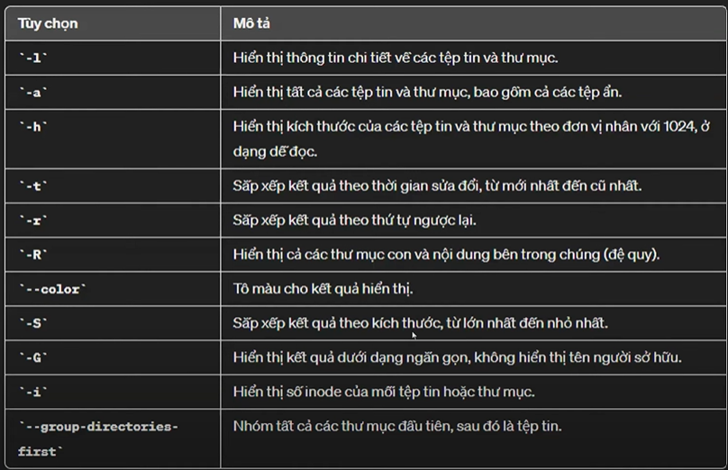
### Tạo mới thư mục 
- Lệnh: mkdir
- Cấu trúc lện: mkdir [Options] Directory 
    - Options: -p: Cho phép tạo thư mục con ngay cả khi chưa có thư mục cha
    - Directory: Tên thư mục muốn tạo
### Xem cây thư mục
- Lệnh : tree
- Cách cài đặ tree: sudo apt install tree
### Xem thông tin thư mục
- Lệnh: du
- du viết tắt của disk usage đc sd để hiện thị thông tin về dung lượng sử dụng trên đĩa của các thư mục
### Xóa thư mục rỗng
- Lệnh rmdir: rmdir [options] directory
- Options:
    - -p: Xóa thư muc và cả thư mục cha
    - Directory: Tên thư mục muốn xóa
### Tạo tập tin
- Tạo tập tin với nội dung text: lệnh echo
    - echo "tam" data/vidu.txt
    - echo "Them 1 dong">>data/vidu.txt
- Tạo tập tin rỗng: lệnh touch
    - touch data/a.txt
### Xem nội dung tập tin
- Tạo tập tin với nội dung text: Lệnh cat
    - cat data/vidu.txt
### Lênh copy
- Lệnh copy: cp
    - cp [Options] Source Dest
- Options: -R,-r: Sao chép toàn bộ thư mục
### Lệnh di chuyển
- Lệnh move: mv
    - mv [Options] Source Dest
- Dùng để đổi tên/di chuyển thư mục hoặc file từ nơi này sang nơi khác
- Options:
    - -i: Nhắc trước khi di chuyển với tập tin thư mục đã có rồi
    - -f: Ghi đè khi di chuyển cới tập tin/thư mục đích đã có rồi
### Xóa tập tin/thư mục
- Lệnh rm 
    - rm [options] file
- dùng để xóa file/thư mục. Lệnh này đc xem là 1 trong những lệnh nguy hiểm của Linux
- Options:
    - -f: xóa ko cần hỏi
    - -i: hỏi trước khi xóa
    - -r: xóa luôn file con bên trong

## Các ký tự đại diện
### Ký tự ?
- Ký tự ? ddc sử dụng để đại diên cho 1 ký tự bất kỳ trong mẫu tìm kiếm
- Lưu ý: Ký tự ? chỉ đại diện cho 1 ký tự duy nhất
### Ký tự *
- Ký tự * đc sử dụng để đại diện cho bất kỳ chuỗi ký tự nào (bao gồm cả chuỗi rỗng) trong 1 mẫu tìm kiếm
- Lưu ý: Ký tựu * có thể đại diện cho bất kỳ số lượng ký tự nào, bao gồm cả ko có ký tự nào

## Các lện xem nội dung tập tin 
- cat [tên tệp]: Hiển thị toàn bộ nôi dung của tệp tin trên màn hình
- more [tên tệp]: Hiển thị nội dung của tệp tin 1 cách trang trang. Nhấn space để di chuyển xuống 1trang, nhấn Enter để di chuyển xuống 1 dòng, và q để thoát khỏi chế độ xem
- less [tên tệp]: Hiển thị nội dung của tệp tin 1 cách tương tác và lùi trang. Sử dụng các phím mũi tên để di chuyển lên/xuống, Space để di chuyển 1 trang, và q để thoát khỏi chế độ xem
- tail [tên tệp]: Hiển thị các dong cuối cùng của tập tin. tail -n [số dòng] [tên tệp]: Hiển thị số lượng dòng cuối cùng đc chỉ định
- head [tên tệp]: Hiển thị các dong đầu tiên của tập tin. head -n [số dòng] [tên tệp]: Hiển thị số lượng dòng đầu tiên đc chỉ định

## Định hướng nhập xuất và đường ống pipeline trong Linux
- >: Xuất dữ liệu ra file. Xóa dữ liệu nếu file cũ đã tồn tại 
- >>: Xuất dữ liệu vào cuối file
- <:nhập dữ liệu từ file
- Đường ống pipeline

## Câu lệnh tìm kiếm grep
- Công cụ tìm kiếm văn bản dòng lệnh
- tim kiếm chuỗi ký tự trong file hoặc thư mục
- Hỗ trợ biểu thức chính quy
- Tìm theo keyword trong 1 file 
- Cấu trúc lệnh: grep [option] PATTERN [FILE]
- Options thông dùng:
    - -c: đếm số lần xuất hiền của string
    - -i: bỏ qua phân biệt hoa thường
    - -v: lọc kết quả ko khơp
    - -n: hiển thị số dòng của từ tìm kiếm trong file
- Ví dụ: tìm từ root trong file passwd
    - #grep 'root' /etc/passwd

## Biểu thức chính quy
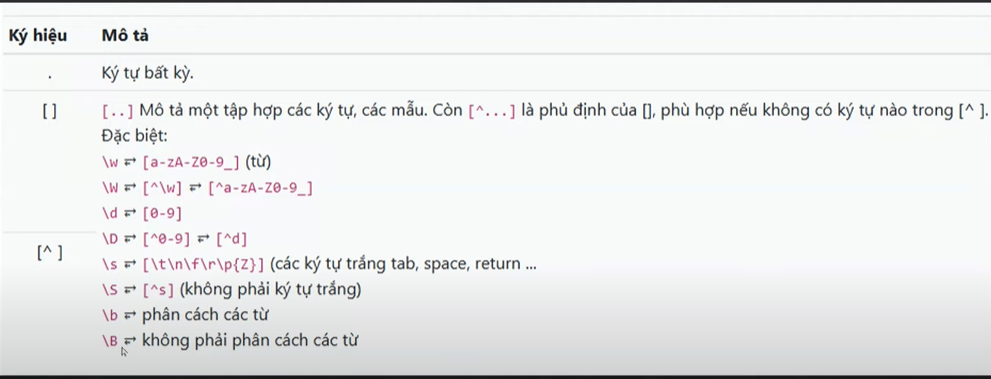
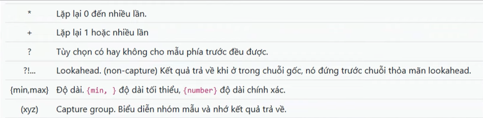
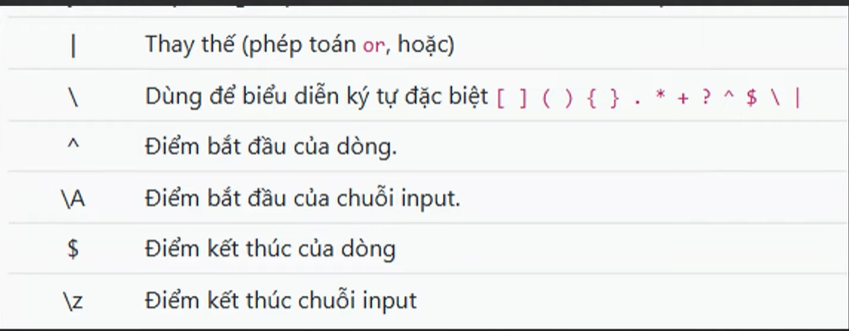

## Tìm kiếm tập tin bằng lệnh find trong Linux
- Lệnh find là lệnh tìm kiếm mạnh nhất với tham số nhừng thường tốn thời gian hơn với các lệnh khác
- Cú pháp: find [vị trí] [tiêu chuẩn tìm]
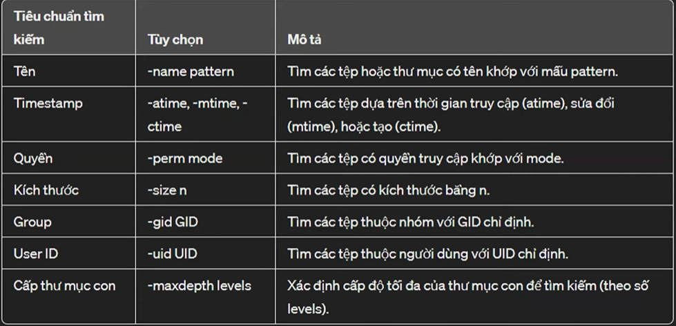
- Tìm find với kích thước xác định
    - find . -type f -size +1M
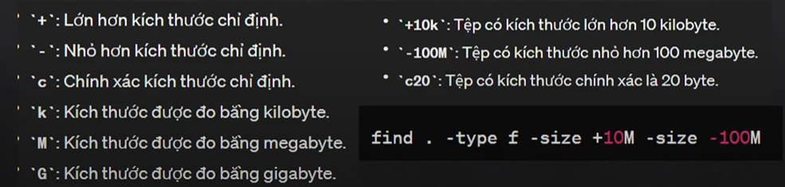
- Sử dụng toán tử -exec để thực thi 1 lênh khác cho từng file đc tìm thấy
    - find . -size +10M -size -100M - exec ls -1h {} \;
- In thông tin kết quả tìm kiếm
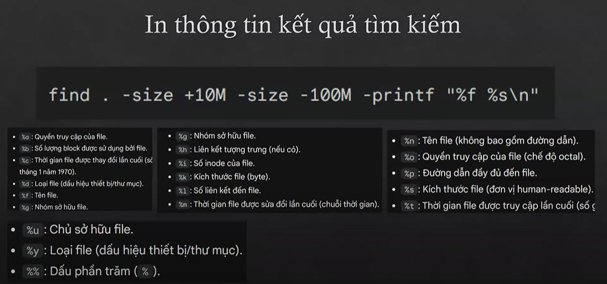
## Câu lệnh tìm kiếm whereis và which trong Linux
### whereis
- Cú pháp: whereis [tùy chọn] tên_lênh
- Chức năng: 
    - Tìm kiếm vị trí của các file liên quan đến 1 lệnh 
    - Hiện thị đường dẫn đến các file đc tìm thấy
- Tùy chọn:
    - -b: Chỉ tìm file thực thi
    - -m: Chỉ tìm file mã nguốn
    - -s: Chỉ tìm trang man
    - -u: CHỉ tìm trong thư mục do người dùng cài đặt
### which
- Cú pháp: which [TÙY CHỌN] TÊN_LỆNH
- Chức năng: 
    - Tìm kiếm vị trí của file thực thi của 1 lệnh
    - Hiển thị đường dẫn đến file thực thi đc tìm thấy
- Tùy chọn:
    - -a: Hiển thi tất cả các file thực thi đc tìm thấy
    - -n: Không hiển thị đường dẫn
    - -p: Hiển thị thông tin chi tiết và file thực thi
## Câu lệnh nén và giải nén trong Linux
### Nén: gzip
- Cú pháp: gzip [OPTIONS] [FILES...]
- Tùy chọn:
    - -c, --sdout: In ra kết quả nén trên màn hình thay vì ghi đè lên tệp tin gốc
    - -d, --decompress: giải nén tập tin đc nén
    - -f, --force: bắt bioock nén tập tim mà ko ko hỏi lại ng dùng
    - -r, --recursive: Nén tất cả các têp tin trong thư mục và các thư mục con
### Giải nén: gunzip
- Cú pháp: gunzip [OPTIONS] [FILES...]
- Tùy chọn:
    - -c, --sdout: In ra giải nén trên màn hình
    - -f, --force: bắt buộc phải giải nén tệp tin mà ko hỏi lại người dùng
    - -r, --recursive: Giải nén tất cả các têp tin trong thư mục và các thư mục con
### Nén và giải nén bằng lệnh tar
- Cú pháp: tar OPTIONS [FILES...]
- Các tùy chọn phổ biến:
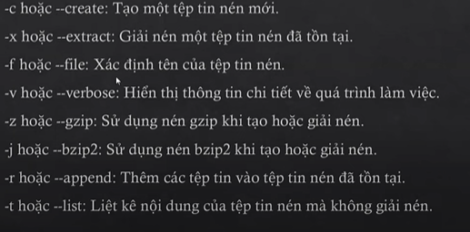

## Hướng dẫn sử dụng trình soạn thảo vi
https://www.youtube.com/watch?v=r-aPxQ3HShs&list=PLyxSzL3F74878husgCe4IF6iJNSCjYTGq&index=19

## Lệnh CUT trong Linux
- Cú pháp tổng quát: cut [OPTIONS] [FILE]
- options:
    - -d, --delimiter=DELIM: xác định ký tự phân cách giữa các đường
    - -f, --fields=LIST: Xác định đường muốn trích xuất, các trường đc phân cách bởi dấu phẩy
    - -c, --characters=LIST: Xác định các ký tự muốn trích xuất từ mỗi dòng
    - -b, cắt theo từng byte

## Các lệnh về ngày giờ trong Linux
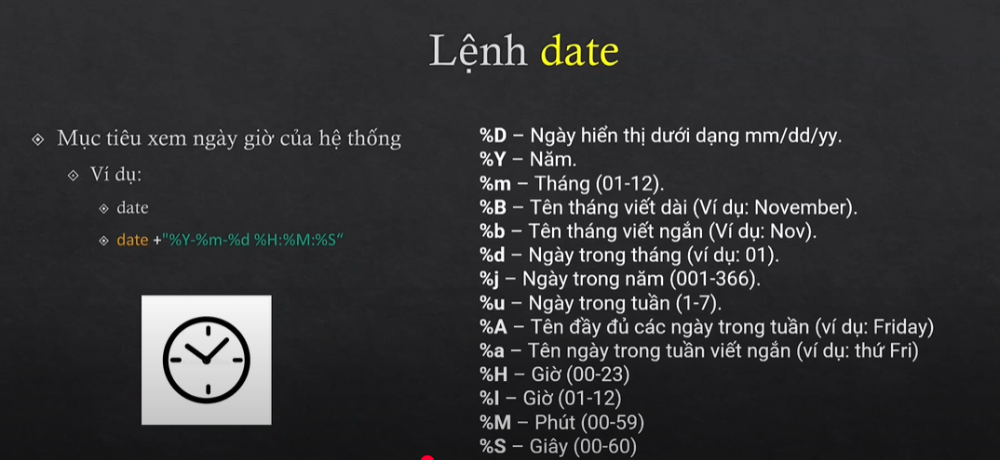
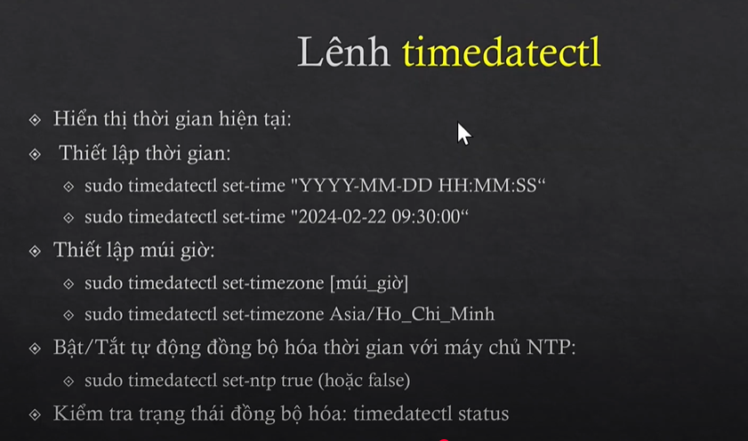

## Các lệnh tắt và khởi động lại máy trong Linux
### Lệnh reboot
- Mục tiêu: Khởi động server, máy tính
- Cú pháp: reboot
### Lệnh shutdow
- Cấu trúc: shutdow [options][time][wall]
- options:
    - -h: shutdown
    - -r: restart
    - -c: cacnel pending shutdow
- time:
    - now: thực hiện ngay lập tức
    - hh:mm: ẩn đinhk thời gian thực hiện
    - +m: sai m phút sẽ thực hiện
- Wall: message thông báo

## Các câu lệnh xem thông tin hệ thống Linux
### Xem thông tin RAM
- Xem tổng dung lượng, dung lượng hiện tại đang dùng, dung lượng còn trống. Có 2 lệnh đó là
- Lệnh: cả /proc/meminfo
    - lệnh cat: dùng đẻ đọc nội dung của file text
    - /proc/meminfo: đây là đường dẫn tới file chứa thông tin RAM có tên là meminfo
- Lệnh: free
### Xem thông tin CPU
- Lệnh cat /proc/cpuinfo
### Hiển thị thông tin kernel
- Lệnh: uname -a
- options: -a : all infomation
### Xem dung lượng ổ cứng
- Xem dung lượng ổ cứng đã dùng và còn trống bao nhiêu: df -h
- options: -h : in kích thước mà người dùng có thể đọc
### Xem thông tin model, serial,... phần cứng
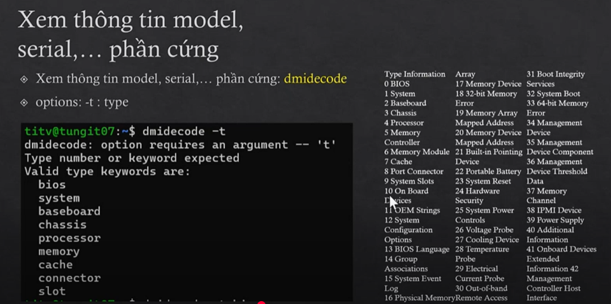
### Xem các tiến trình
- Lệnh: top
### Xem dung lượng của thư mục
- Lệnh xem dung lượng của thư mục: du
- options:
    - -s: xuất kết quả theo summarize
    - -h: in kích thước mà người dùng có thể đọc
- Ví dụ: Xem dung lượng của thư mục /etc
    - du -sh /etc
### Lệnh xem tên sever
- Lệnh xem tên sever: hostname
### Xem địa chỉ ip
- Lệnh xem đỉa chỉ ip: ifconfig

## 26. Quản trị người dùng trong hệ thống Linux
### Quản trị User
- có 2 tk user: tk user hệ thống và tk user ng dùng
- User hệ thống: dùng để thực thi các module, script cần thiết phục vụ cho HĐH
- User ng dùng: là những tk để login để sd hđh. Trong các tk user thì tk user root là tk qtrg nhất. Tài khoản này đc tự động tạo ra khi cài đặt linux. Tài khoản này k thể đổi tên hoặc xóa. Chỉ làm việc với user root khi muốn thực hiên công tác quản trị hệ thống, trong các trường hợp khác chỉ nên làm việc với tk user bình thường
### Đặc điểm của User
- Trên mỗi user là duy nhất, chỉ có thể đặt tên chữ thường, hoa
- Mỗi user có 1 mẫ định danh duy nhất (uid)
- Mỗi user có thể thuộc về nhiều nhóm
- Tài khoản root có uid = gid = 0
### File /etc/passwd
- Là file văn bản chứa thông tin user. Đều có thể ddcj đc nhưng chỉ có root mới có quyền thay đổi
- Để xem nd của file dùng lệnh: #cat /etc/passwd
- Cấu trúc file gồm nhiều hàng mỗi hàng là 1 tt user
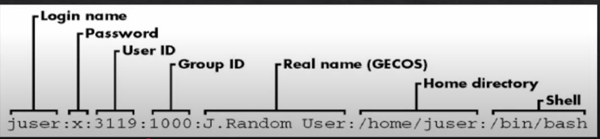
### File /etc/shadow
- Là tập tin vb chứa tt về mật khảu của các tk user. Chỉ có root mới có quyền đọc tập tin này. User root có quyền reset
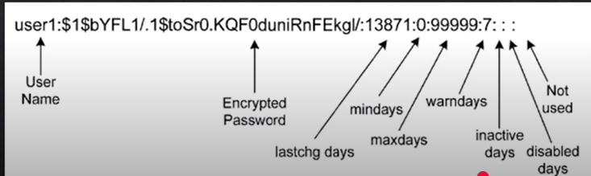
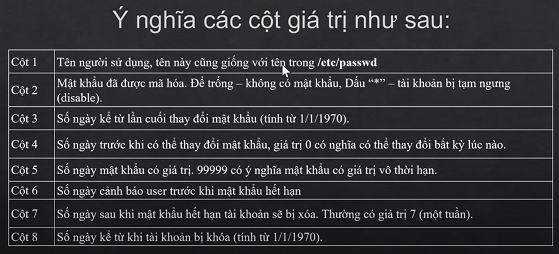

## 27 - Các câu lệnh quản trị người dùng
### Tạo tài khoản ng dùng
- Lệnh useradd: Tạo tk user
- Cấu trúc lệnh: useradd [options] login_name
- options;
    - -c: comment
    - -u: set user ID
    - -d: CHỉ định thư mục home
    - -g: Chỉ định nhóm chính
    - -G: Chỉ định nhóm phụ
    - -s: cjir định shell cho user sd
### Thiết lập các chính sách (policy) cho user
- Lệnh change: dùng để thiết lập các chính sách cho user
- Cấu trúc lệnh: chage [options] login_name
## 28 - Quản trị group
### QUản trị group
- Nhóm là tập hợp của nhiều user. Mỗi nhóm có tên duy nhất, và có 1 mã định dạh duy nhất (gid). Kji tạo 1 user(ko dùng option -g) thì mặc định 1 group tạo ra
### File /etc/group
- Là tập tin vb chứa thông tin về nhóm user. Mọi user có thể đọc tập tin này nhưng chỉ có root mới có quyền thay đổi 
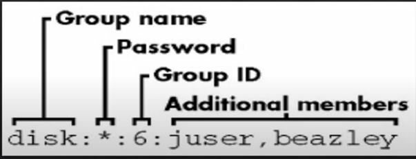
## 29 - Các lệnh quản trị group
### Tạo nhóm
- Lệnh groupadd: Tạp nhóm
- Cấu trúc lênh: groupadd [options] group
- group: Tên nhóm định nhĩa
### Sửa thông tin nhóm
- Lệnh groupmod: Sửa thông tin nhóm
- Câu trúc lệnh: groupmode [option] group
- options:
    - -g GID: sửa mã nhóm thành GID
    - -n group_name: Sửa tên nhóm thành group_name
- group: Tên nhóm càn chỉnh sửa
### Xóa nhóm
- Lệnh groupdel: dingf để xóa nhóm
- Cấu trúc lệnh: groupdel group

## 30 - Phân quyền trên hệ thống file và thư mục
### Phân quyền
- Phân quyền truy xuất đến các tài nguyên Linux là 1 vđ quan trọng
- Phân quyền giúp tăng mức độ an toàn, đảm bảo đúng trách nhiệm - quyền hạn của từng user khi sử dụng tài nguyên trên máy
### Quyền truy xuất
- Quyền truy xuất trên thư mục và tập tin đc trình bày khi thực hiện leenhk ls -l
- Đoc (read)
- Ghi (write)
- Thực thi (excute)
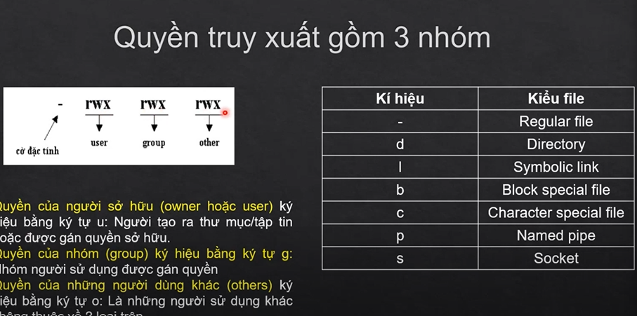
### Biểu diễn quyền truy xuất
- r: read
- w: write
- x: excute
- -: ko có quyền
- Quyền hạn trên 1 file sẽ gồm 3 quyền (owner, group, others) nên ds quyền gồm 9 ký tự

## 31 - Các lệnh thay đổi quyền, người, nhóm sở hữu file và thư mục
### Lệnh chmod
- Lệnh chmod: Thay đổi quyền truy xuất thư mụ/tập tin
- Cấu trúc lệnh: chmod [options] Mode file
- options:
    - -R: áp dụng đổi với thư mục làm cho lệnh chmod có tác dụng lên tát cả thư mục con
    - Mode: Quyền truy xuất mới trên tập tin
### Mode: QUyền truy xuất mới trên tạp tin
- Quyền truy xuất gán cho từng nhóm
    - u: owner
    - g: group
    - o: others
- Ký tự 
    - "+" thêm quyền
    - "-" Rút bớt quyền
    - "-" gán
### Lệnh chown
- Lệnh chown: Thay đổi người sở hữu thư mục tập tin.
- Cấu trúc lệnh: chown [options] owner file
- options:
    - -R
    - Owner
### Lệnh chgrp
- Lệnh chgrp: Thay đổi nhóm sở hữu